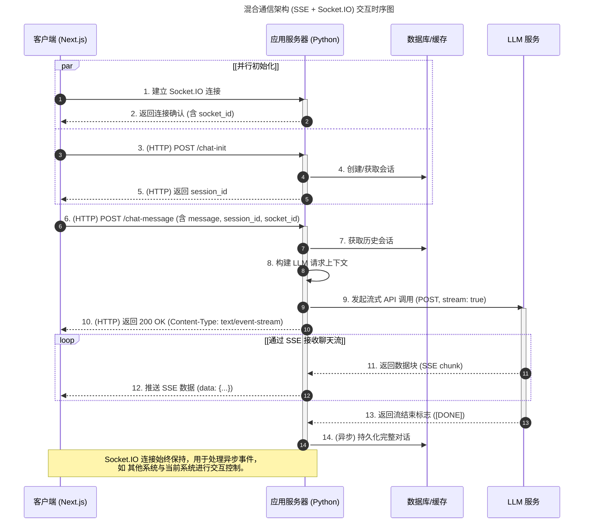

<div align="center" style="padding: 3.125rem;">

<h1 style="color: #007bff;">Agenta</h1>

<a href="https://github.com/winyeahs/agenta/stargazers">
  
</a>
<a href="https://github.com/winyeahs/agenta/blob/main/LICENSE">
  
</a>
<a href="https://www.python.org/">
  
</a>
<a href="https://nodejs.org/">
  
</a>
<a href="https://github.com/winyeahs/agenta#部署指南">
  
</a>
<a href="https://github.com/winyeahs/agenta/issues">
  
</a>
<a href="https://github.com/winyeahs/agenta/pulls">
  
</a>
<a href="https://github.com/winyeahs/agenta/commits/main">
  
</a>

</div>


本项目是一个前后端分离的、功能强大的智能体应用开发平台。它深度集成了大型语言模型（LLM）、数字人、多模态能力和外部工具，旨在提供一个灵活、可扩展的框架，用于快速构建和部署复杂的 AI 应用。

平台的核心是一个基于 Agent 的架构，允许开发者创建、管理和编排不同的智能体，每个智能体都可以拥有自己的模型、工具和知识库。

## Summary

- [快速开始](#快速开始)
- [目录结构](#目录结构)
- [功能展示](#功能展示)
- [使用场景](#使用场景)
- [交互开发](#交互开发)
- [交流与社区](#交流与社区)

## 快速开始

以下是在本地开发环境快速启动项目的步骤。

### 安装环境

确保本地已安装：
- Python 3.12+
- Node.js 22.11+
- MySQL, Redis, Milvus (向量数据库)

#### 1. 启动后端 (API)

```bash
cd api

# 1. 创建并激活虚拟环境 (推荐)
  #安装 uv 管理虚拟环境
  pip install uv

  #创建虚拟环境
  uv venv

  #激活虚拟环境
  # Windows:
  venv\Scripts\activate
  # Linux/macOS:
  source .venv/bin/activate

# 2. 安装依赖
  uv pip install -r requirements.txt

# 3. 同步环境（可选）
  uv pip sync requirements.txt

# 4. 配置环境变量
  # 复制 .env 到 .env.local 并根据需要修改
  cp .env .env.local

# 5. 启动MCP服务
  cd mcp
  用git bash 运行 start.sh 脚本

# 6. 启动服务
  python app.py
```

#### 2. 启动前端 (Web)

```bash
  cd web

# 1. 安装依赖
  pnpm install

# 2. 配置环境变量
  # 复制 .env 到 .env.local 并根据需要修改
  cp .env .env.local

# 3. 启动开发服务器
  pnpm dev
```

前端服务将在 `http://localhost:3000` 运行。

### 配置说明

项目的配置主要通过 **环境变量** 进行管理。

#### 后端 (`api/.env`)

后端启动时会加载根目录下的 `.env` 文件。关键配置项包括：

-   `FLASK_ENV`: 运行环境 (`development` 或 `production`)。
-   `SECRET_KEY`: Flask 应用的密钥。
-   `ALLOWED_ORIGINS`: CORS 允许的跨域来源列表，用逗号分隔。
-   **数据库配置**:
    -   `DB_USERNAME`, `DB_PASSWORD`, `DB_HOST`, `DB_PORT`, `DB_NAME`
-   **RAG (Milvus) 配置**:
    -   `MILVUS_HOST`, `MILVUS_PORT`, `MILVUS_DB`, `MILVUS_USER`, `MILVUS_PASSWORD`
-   **MCP 初始化超时**:
    -   `MCP_INIT_TIMEOUT`: MCP 服务启动的超时时间（秒）。

#### 前端 (`web/.env.local`)

前端配置通过 `NEXT_PUBLIC_` 前缀的环境变量注入。

-   `NEXT_PUBLIC_API_BASE_URL`: 后端 API 的地址。
-   `NEXT_PUBLIC_SOCKET_URL`: Socket.IO 服务的地址。
-   `NEXT_PUBLIC_DIGITAL_HUMAN_URL`: 数字人服务的地址。
-   `NEXT_PUBLIC_MAP_URL`: 地图服务的 URL。
-   **ICE 服务器 (WebRTC)**:
    -   `NEXT_PUBLIC_ICE_SERVERS_URL`
    -   `NEXT_PUBLIC_ICE_SERVERS_USERNAME`
    -   `NEXT_PUBLIC_ICE_SERVERS_CREDENTIAL`

#### 数字人服务配置 (`digitalhuman/`)

数字人功能是一个独立的实时流媒体服务，需要数据库配置对应数字人模型ID。

-   **数据库配置 (`agent_digitalhuman` 表)**:
    -   通过 API 或管理后台在 `agent_digitalhuman` 表中创建一条记录来注册一个数字人。
    -   **`model_id`**: 这是**最核心的配置项**。它是一个**手动指定**的字符串，作为数字人渲染模型的唯一标识符。这个 ID 必须与存放在服务器上的模型文件名或标识相匹配。


#### MCP 服务配置 (`mcp/`)

MCP (Model Context Protocol) 是一个标准的工具调用协议，允许 Agent 发现并调用外部工具。在本项目中，它用于将各种能力（如发送邮件、操作Excel、生成图表）封装为 Agent 可用的标准化服务。

-   **服务启动**:
    -   所有 MCP 服务都由根目录下的 `mcp/start.sh` 脚本统一启动。在启动主后端应用之前，必须先运行此脚本。
    -   该脚本会并行启动 `mcp-server-chart`、`mcp-email-docker` 和 `excel-mcp-server` 等多个独立服务。

-   **数据库配置 (`agent_tool` 表)**:
    -   一个 MCP 服务作为一个“工具”在数据库的 `agent_tool` 表中进行注册。
    -   关键配置项包括：
        -   `tool_type`: 1代表外部mcp服务，2代表内部mcp服务。
        -   `tool_name`: MCP 服务的名称，创建连接外部mcp服务时查看使用。
        -   `tool_url`: MCP 服务的访问地址 (例如: "http://localhost:1122/sse")。
        -   `request_type`: 与 MCP 服务的通信协议，如 `1` (SSE), `2` (Streamable HTTP), `3` (stdio)。
        -   `request_header`: （可选）与 MCP 服务通信时需要附加的 HTTP 请求头，为 JSON 格式。

-   **可直接在后台工具中配置MCP服务**:
    -   在数据库的 `agent_tool` 表中，为每个 MCP 服务创建一条记录。
    -   配置 `tool_type` 为 `1`，`tool_name` 为服务名称，`tool_url` 为服务地址，`request_type` 为通信协议。


### 目录结构

```
.
├── api/                # 后端 Flask 应用
│   ├── controllers/    # API 路由和控制器
│   ├── core/           # 核心业务逻辑 (Agent, MCP, RAG, Mem0)
│   ├── database/       # 数据库脚本
│   ├── models/         # SQLAlchemy 数据模型
│   ├── services/       # 业务逻辑服务层
│   ├── tools/          # Agent 可用的工具
│   ├── factory.py      # Flask 应用工厂
│   ├── requirements.txt # Python 依赖
│   └── Dockerfile      # 后端 Dockerfile
├── web/                # 前端 Next.js 应用
│   ├── app/            # Next.js App Router
│   ├── components/     # React 组件
│   ├── config/         # 前端配置文件
│   ├── service/        # API 请求服务
│   ├── store/          # Zustand 状态管理
│   ├── package.json    # Node.js 依赖
│   └── Dockerfile      # 前端 Dockerfile
├── digitalhuman/       # 数字人服务
├── mcp/                # MCP (Model Context Protocol) 服务
│   ├── mcp-email-docker/ # 邮件 MCP 服务
│   └── ...
└── PROJECT_DOC.md      # 本文档
```

## 功能展示

#### 1、Agent 管理:
支持创建、配置和管理多个智能体 (Agent)。
<div align="center">
  
</div>

#### 2、多模型支持:
可接入并切换不同的 LLM (如 阿里百炼, DeepSeek, Doubao 等)。
<div align="center">
  
  <br>
  
</div>

#### 3、MCP工具 (Model Context Protocol):
一个标准的工具调用协议，可以接入多种外部工具（如发送邮件、操作 Excel、生成图表等）封装成 Agent 可调用的标准化工具。
<div align="center">
  
</div>

#### 4、知识库
可以添加多种知识库，如文档、数据库、API等，用于Agent的知识库检索。
<div align="center">
  
</div>

#### 5、丰富交互卡片:
支持以结构化的卡片形式展示天气、报告等复杂信息，提升交互体验。
<div align="center">
  
</div>

#### 6、数字人集成:
可绑定多种数字人样式，支持与实时数字人进行音视频交互。
<div align="center">
  
</div>
  
#### 7、数字员工:
内置定时任务系统，可用于执行周期性或特定时期任务等。
<div align="center">
  
</div>


## 使用场景

#### 1、数字人讲解智能体
直接与数字人语音交互，实现实时讲解和问答。可扩展作为虚拟主播进行直播、在展会或营业厅作为数字人向导提供信息、或作为AI教师进行在线教育。

待插入 - 管控系统数字人语音操作的MP4录屏
<div align="center">
  
</div>

#### 2、企业客服智能体
利用聊天、知识库（RAG）和卡片展示能力，构建能准确回答客户问题、引导用户操作的智能客服系统。

<div align="center">
  
</div>


#### 3、系统交互智能体
通过智能体聊天页面与系统进行交互，实现对网页页面的智能感知，简单操作与数据分析回答等功能。

<div align="center">
  
</div>

#### 4、移动端交互智能体
在移动设备上，用户可以通过语音或文字与智能体进行交互，实现信息查询、任务管理、智能提醒等功能，成为用户的便携式个人助理。

<div style="display: flex; justify-content: center; align-items: flex-start; gap: 2.5rem; padding: 1.25rem 0; text-align: center;">
  <div>
    
  </div>
  <div>
    
  </div>
</div>

#### 5、移动端管理智能体
将 Agenta 智能体以悬浮窗或内嵌聊天窗口的形式集成到现有移动应用中。当用户在应用内遇到问题时，可随时唤醒智能体，实现即时问答和业务引导，提升用户体验。


<div style="display: flex; justify-content: center; align-items: flex-start; gap: 2.5rem; padding: 1.25rem 0; text-align: center;">
  <div>
    
  </div>
  <div>
    
  </div>
</div>

## 交互开发

本章节详细阐述了 Agenta 平台中，用户与智能体进行交互的核心技术实现。平台采用了一种**基于 Server-Sent Events (SSE) 和 Socket.IO 的混合通信架构**，以兼顾流式聊天的高效性和复杂智能体交互的灵活性。

*   **Server-Sent Events (SSE):** 作为**主数据通道**，负责从服务器到客户端高效、单向地传输 LLM 生成的文本流。
*   **Socket.IO:** 作为**辅助控制信道**，提供一个持久化的双向连接，用于处理低延迟的、异步的事件和控制信令，例如 Agent 等待用户输入、数字人状态同步等。

### 1. 端到端交互时序图 (Hybrid Architecture)

下图展示了在混合架构下，从用户初始化连接到完成一次完整流式聊天的交互流程。



**流程步骤详解:**

1.  **建立 Socket.IO 连接:** 客户端初始化时，与应用服务器建立一个持久的 Socket.IO 连接，作为控制信道。
2.  **返回连接确认:** 服务器确认连接，并返回一个唯一的 `socket_id` (`request.sid`)。客户端必须缓存此 ID。
（Socket.IO 连接与 HTTP 会话是独立并行的，只有与其他系统交互的时候使用Socket.IO 连接进行交互控制。）
3.  **初始化 HTTP 会话:** 并行地，客户端通过 `POST /chat-init` 请求初始化一个聊天会话。
4.  **创建/获取会话:** 服务器在数据库中创建或查找会话记录。
5.  **返回 session_id:** 服务器通过 HTTP 响应返回 `session_id`，用于标识本次对话。
6.  **发送聊天消息:** 用户发送消息。客户端发起一个 **HTTP POST** 请求到 `/chat-message`。请求体中**必须同时包含**用户的消息、`session_id` 和 `socket_id`。
7.  **获取历史会话:** 服务器根据 `session_id` 从数据库检索上下文。
8.  **构建 LLM 请求上下文:** 服务器整合历史记录和当前消息。
9.  **发起流式 API 调用:** 服务器向 LLM 服务发起一个标准的流式 HTTP 请求 (`stream: true`)。
10. **返回 SSE 响应头:** 服务器立即向客户端返回一个 HTTP 200 响应，并将 `Content-Type` 设置为 `text/event-stream`，告知客户端这是一个 SSE 连接。
11. **返回数据块:** LLM 服务开始逐块返回生成的内容。
12. **推送 SSE 数据:** 服务器将收到的数据块直接作为 SSE 事件推送给客户端。前端通过 `EventSource` API 监听并渲染。
13. **返回流结束标志:** LLM 生成完毕，发送结束信号。服务器关闭 SSE 连接。
14. **持久化对话:** 服务器异步地将完整的对话记录存入数据库。

### 2. 通信协议：SSE 与 Socket.IO 命名事件

本项目的通信协议分为两个部分，分别对应两个不同的技术通道。

#### 主数据通道: Server-Sent Events (SSE)

用于从服务器向客户端单向传输 LLM 的回复文本流。

*   **触发方式:** 由客户端向 `/chat-message` 端点发起 `POST` 请求。
*   **数据格式:** 服务器返回的数据遵循 SSE 规范。每个消息块都以 `data:` 开头，后跟一个 JSON 字符串，并以两个换行符结束。
    ```
    data: {"content": "Agenta 是一个", "card": null}

    data: {"content": "功能强大的", "card": null}

    data: [DONE]
    ```
*   **前端处理:** 客户端使用 `EventSource` API 或类似的库（如 `fetch-sse`）来监听此流，并解析 `data` 字段的内容。

#### 辅助控制信道: Socket.IO 命名事件

用于处理所有非聊天流的、低延迟的、双向的或服务器主动发起的事件。

*   **连接:** 客户端在加载时建立一个持久的 Socket.IO 连接。
*   **协议:** 通信不依赖于消息体内的 `type` 字段，而是使用 **命名事件 (Named Events)**。每个事件都有一个唯一的名称和对应的 JSON 负载 (payload)。

**核心事件列表:**

*   **`connect` (内置):** 客户端成功连接时触发。
*   **`disconnect` (内置):** 客户端断开连接时触发。
*   **`connect_response` (S2C - 服务器到客户端):** 服务器确认连接成功后发送。
    ```json
    {
      "status": "connected",
      "client_id": "unique_socket_session_id"
    }
    ```
*   **`systemdata` (C2S - 客户端到服务器):** 客户端向服务器报告其具备的系统能力或功能。
    ```json
    {
      "action": "register_functions",
      "payload": [
        { "name": "function_name", "description": "..." }
      ]
    }
    ```
*   **`agent_response` (C2S):** 当 Agent 通过服务器请求用户输入后，客户端使用此事件将用户的响应数据发回给等待的 Agent。
    ```json
    {
      "wait_id": "wait_id_from_server_request",
      "response_data": { "user_input": "这是我的确认" }
    }
    ```
*   **`digitalhuman_completion` (C2S):** 客户端通知服务器，数字人已完成当前的讲话任务。
    ```json
    {
      "wait_id": "wait_id_for_speech",
      "completion_data": { "status": "finished" }
    }
    ```

### 3. LLM API 调用与双通道协同

后端服务器作为安全代理调用 LLM API，并巧妙地利用双通道架构实现了复杂的交互。

**协同工作核心机制:**

客户端在发起流式聊天请求 (`POST /chat-message`) 时，**必须将通过 Socket.IO 获得的 `socket_id` 包含在 HTTP 请求体中**。

这个 `socket_id` 就像一个“回邮地址”。它使得处理 HTTP 请求的后端逻辑能够：
1.  通过 SSE 高效地返回 LLM 的文本流。
2.  如果在生成过程中，Agent 需要暂停并向用户请求额外信息（例如，调用了一个需要确认的工具），后端可以根据请求中携带的 `socket_id`，通过 Socket.IO 信道向**正确的客户端** `emit` 一个事件（如 `wait_for_user_input`），从而实现异步的用户交互，而不会中断主聊天流程。

### 4. 核心数据结构定义

*   **HTTP API - `/chat-message` 请求体:**
    ```json
    {
      "message": "你好，请介绍一下 Agenta 项目。",
      "stream": true,
      "session_id": "session_abc_123",
      "socket_id": "unique_socket_session_id",
      "app_uuid": "app_uuid_xyz",
      "user_id": "user_123",
      "is_digitalhuman": false
    }
    ```

*   **SSE - 流式数据块 (`data:` 字段内容):**
    ```json
    {
      "content": "这是LLM返回的一段文本。",
      "card": null
    }
    ```

*   **Socket.IO - `agent_response` 事件负载 (C2S):**
    ```json
    {
      "wait_id": "wait_id_from_server_request",
      "response_data": {
        "user_choice": "confirm",
        "details": "我已确认操作。"
      }
    }
    ```

*   **Socket.IO - 服务器请求用户输入的事件负载 (S2C, 示例):**
    ```json
    // 事件名: 'wait_for_input'
    {
      "wait_id": "new_wait_id_for_this_request",
      "input_schema": {
        "type": "string",
        "description": "请输入您的确认码："
      }
    }
    ```
## 交流与社区

我们热情欢迎所有开发者和用户加入我们的社区！在这里，你可以自由提问、分享经验、贡献代码，共同推动项目的发展。

<div style="display: flex; justify-content: center; align-items: flex-start; gap: 2.5rem; padding: 1.25rem 0; text-align: center;">
  <div>
    <h4>微信交流群</h4>
    
    <p>扫码加入微信技术交流群</p>
  </div>
  <div>
    <h4>QQ 交流群</h4>
    
    <p>扫码或搜索群号 <code>[你的QQ群号]</code> 加入</p>
  </div>
</div>

**更多链接:**

- **报告问题与建议 (Issues):** 前往 [GitHub Issues](https://github.com/winyeahs/agenta/issues) 提交您发现的 Bug 或功能建议。
- **参与讨论 (Discussions):** 加入我们的 [GitHub Discussions](https://github.com/winyeahs/agenta/discussions) 进行更深入的技术探讨和想法交流。
- **联系我们 (Contact):** 如有商务合作或其他事宜，请发送邮件至 `[your-official-email@example.com]`。

