<div align="center" style="padding: 3.125rem;">
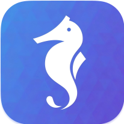
<h1 style="color: #007bff;">Agenta</h1>

<a href="https://github.com/winyeahs/agenta/stargazers">
  
</a>
<a href="https://github.com/winyeahs/agenta/blob/main/LICENSE">
  
</a>
<a href="https://www.python.org/">
  
</a>
<a href="https://nodejs.org/">
  
</a>
<a href="https://github.com/winyeahs/agenta#部署指南">
  
</a>
<a href="https://github.com/winyeahs/agenta/issues">
  
</a>
<a href="https://github.com/winyeahs/agenta/pulls">
  
</a>
<a href="https://github.com/winyeahs/agenta/commits/main">
  
</a>

</div>


本项目是一个前后端分离的、功能强大的智能体应用开发平台。它深度集成了大型语言模型（LLM）、数字人、多模态能力和外部工具，旨在提供一个灵活、可扩展的框架，用于快速构建和部署复杂的 AI 应用。

平台的核心是一个基于 Agent 的架构，允许开发者创建、管理和编排不同的智能体，每个智能体都可以拥有自己的模型、工具和知识库。

## Summary

- [快速开始](#快速开始)
- [目录结构](#目录结构)
- [功能展示](#功能展示)
- [使用场景](#使用场景)
- [交互开发](#交互开发)
- [交流与社区](#交流与社区)

## 快速开始

以下是在本地开发环境快速启动项目的步骤。

### 安装环境

确保本地已安装：
- Python 3.12+
- Node.js 22.11+
- MySQL, Redis, Milvus (向量数据库)

#### 1. 启动后端 (API)

```bash
cd api

# 1. 创建并激活虚拟环境 (推荐)
  #安装 uv 包管理器
  pip install uv

  #创建虚拟环境
  uv venv

  #激活虚拟环境
  # Windows:
  venv\Scripts\activate
  # Linux/macOS:
  source .venv/bin/activate

# 2. 安装依赖
  uv pip install -r requirements.txt

# 3. 同步环境（可选）
  uv pip sync requirements.txt

# 4. 配置环境变量
  # 进入env文件，配置数据库、Milvus向量数据库、大模型、向量化API等相关数据
  cp .env

# 5. 启动MCP服务
  cd mcp/
  用git bash 运行 start.sh 脚本

# 6. 启动数字人服务
  cd digitalhuman/
  python app.py

# 6. 回到后端根目录/api，启动后端服务
  python app.py
```

#### 2. 启动前端 (Web)

```bash
  cd web

# 1. 安装依赖
  pnpm install

# 2. 配置环境变量
  # 进入env文件，配置后端基础地址等相关数据
  cp .env

# 3. 启动开发服务器
  pnpm dev
```

前端服务将在 `http://localhost:3000` 运行。

### 配置说明

项目的配置主要通过 **环境变量** 进行管理，详细请看.ven文件内配置说明。

#### 后端 (`api/.env`)

后端启动时会加载根目录下的 `.env` 文件。关键配置项包括：

-   `FLASK_ENV`: 运行环境 (`development` 或 `production`)。
-   `SECRET_KEY`: Flask 应用的密钥。
-   `ALLOWED_ORIGINS`: CORS 允许的跨域来源列表，用逗号分隔。
-   **数据库配置**:
    -   `DB_USERNAME`, `DB_PASSWORD`, `DB_HOST`, `DB_PORT`, `DB_NAME`
-   **Milvus向量数据库配置**:
    -   `MILVUS_HOST`, `MILVUS_PORT`, `MILVUS_DB`, `MILVUS_USER`, `MILVUS_PASSWORD`
-   **知识图谱数据库配置**:
    -   `NEO4J_URL`, `NEO4J_USERNAME`, `NEO4J_USERNAME`
-   **MCP 初始化超时**:
    -   `MCP_INIT_TIMEOUT`: MCP 服务启动的超时时间（秒）。

#### 前端 (`web/.env`)

前端关键配置包括：

-   `NEXT_PUBLIC_API_BASE_URL`: 后端 API 的地址。
-   `NEXT_PUBLIC_SOCKET_URL`: Socket.IO 服务的地址。
-   `NEXT_PUBLIC_DIGITAL_HUMAN_URL`: 数字人服务的地址。
-   `NEXT_PUBLIC_MAP_URL`: 地图服务的 URL。


#### MCP 服务配置 (`mcp/`)

MCP (Model Context Protocol) 是一个标准的工具调用协议，允许 Agent 发现并调用外部工具。在本项目中，它用于将各种能力（如发送邮件、操作Excel、生成图表）封装为 Agent 可用的标准化服务。

-   **服务启动**:
    -   所有 MCP 服务都由根目录下的 `mcp/start.sh` 脚本统一启动。在启动主后端应用之前，必须先运行此脚本。
    -   该脚本会并行启动 `mcp-server-chart`、`mcp-email-docker` 和 `excel-mcp-server` 等多个独立服务。


### 目录结构

```
.
├── api/                # 后端 Flask 应用
│   ├── controllers/    # API 路由和控制器
│   ├── core/           # 核心业务逻辑 (Agent, MCP, RAG, Mem0)
│   ├── database/       # 数据库脚本
│   ├── models/         # SQLAlchemy 数据模型
│   ├── services/       # 业务逻辑服务层
│   ├── tools/          # Agent 可用的工具
│   ├── factory.py      # Flask 应用工厂
│   ├── requirements.txt # Python 依赖
│   └── Dockerfile      # 后端 Dockerfile
├── web/                # 前端 Next.js 应用
│   ├── app/            # Next.js App Router
│   ├── components/     # React 组件
│   ├── config/         # 前端配置文件
│   ├── service/        # API 请求服务
│   ├── store/          # Zustand 状态管理
│   ├── package.json    # Node.js 依赖
│   └── Dockerfile      # 前端 Dockerfile
├── digitalhuman/       # 数字人服务
├── mcp/                # MCP (Model Context Protocol) 服务
│   ├── mcp-email-docker/ # 邮件 MCP 服务
│   └── ...
└── README.md      # 本文档
```

## 功能展示

#### 1、智能体应用管理:
支持创建、配置和管理多个智能体应用，每个智能体应用都有自己单独的mcp与知识库等配置。
<div align="center">
  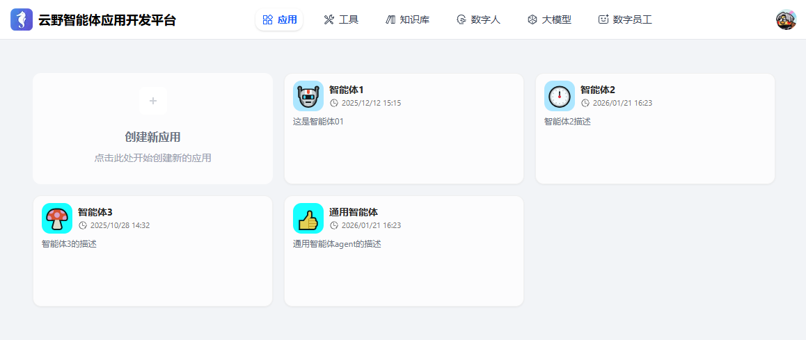
</div>

#### 2、多模型支持:
可接入并切换不同的 LLM (如 阿里百炼, DeepSeek, Doubao 等)。
<div align="center">
  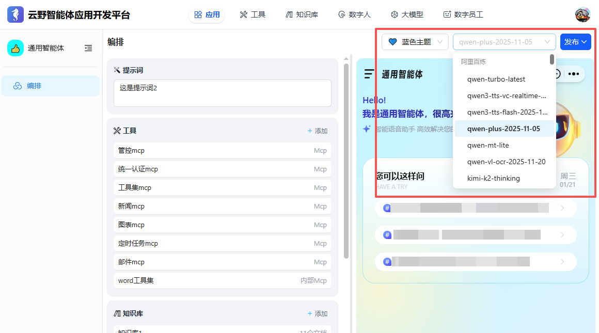
  <br>
  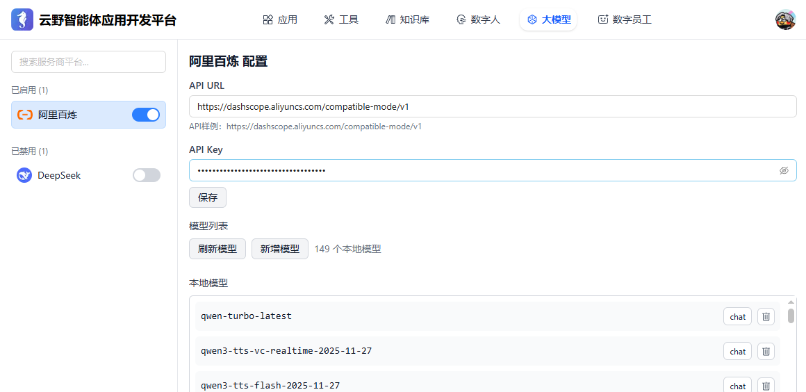
</div>

#### 3、丰富交互卡片:
支持以结构化的卡片形式展示天气、报告等复杂信息，提升交互体验。
<div align="center">
  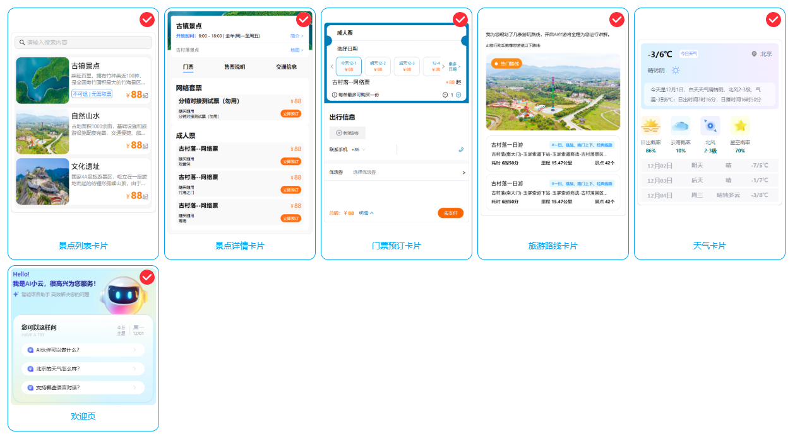
</div>

#### 4、MCP工具 (Model Context Protocol):
一个标准的工具调用协议，可以接入多种外部工具（如发送邮件、操作 Excel、生成图表等）封装成 Agent 可调用的标准化工具。
<div align="center">
  
</div>

#### 5、知识库
可以添加多种知识库，如文档、数据库、API等，用于Agent的知识库检索。
<div align="center">
  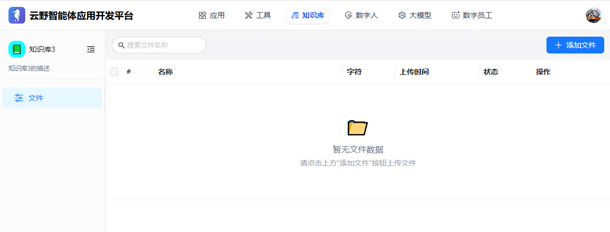
</div>

#### 6、数字人集成:
可绑定多种数字人样式，支持与实时数字人进行音视频交互。
<div align="center">
  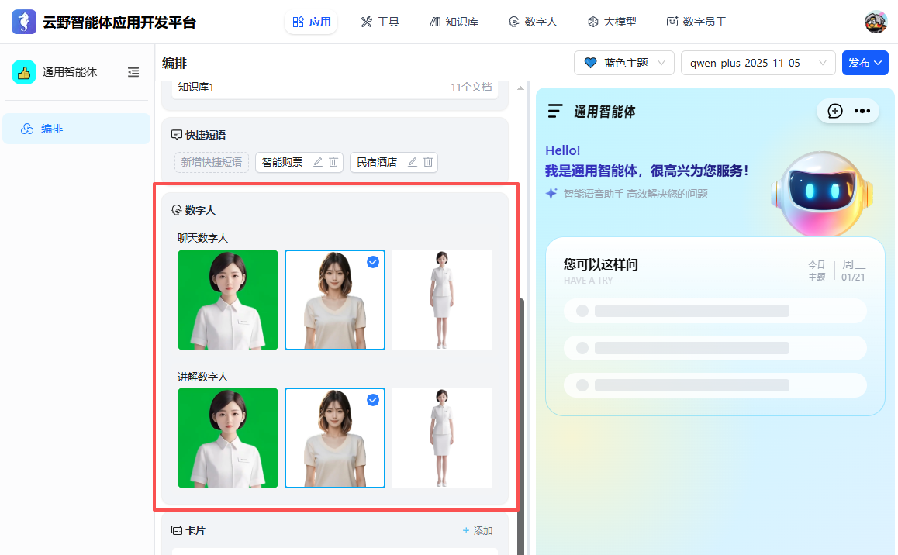
</div>
  
#### 7、数字员工:
内置定时任务系统，可用于执行周期性或特定时期任务等。
<div align="center">
  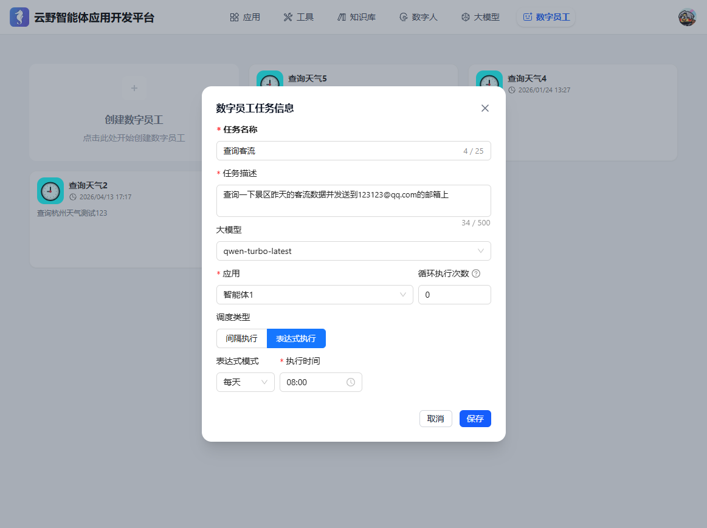
</div>


## 使用场景

#### 1、数字人讲解智能体
直接与数字人语音交互，实现实时讲解和问答。可扩展作为虚拟主播进行直播、在展会或营业厅作为数字人向导提供信息、或作为AI教师进行在线教育。

<div align="center">
  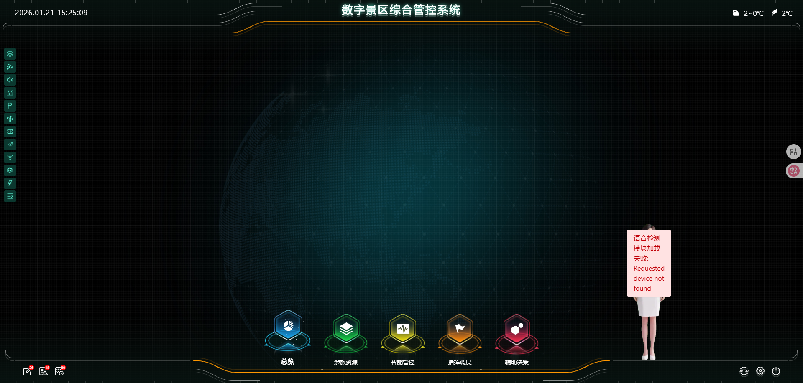
</div>

#### 2、企业客服智能体
利用聊天、知识库（RAG）和卡片展示能力，构建能准确回答客户问题、引导用户操作的智能客服系统。

<div align="center">
  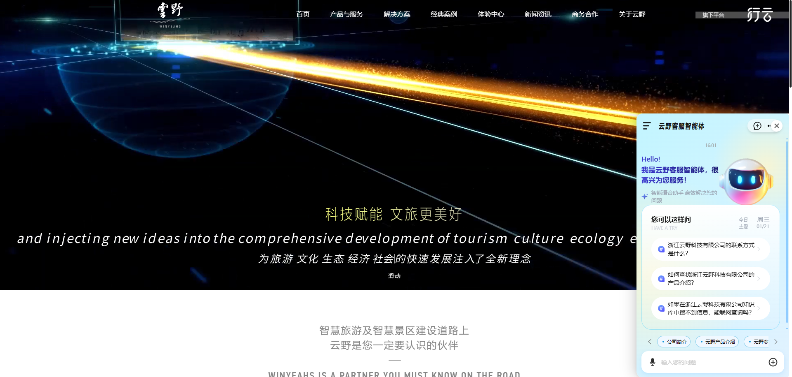
</div>


#### 3、系统交互智能体
通过智能体聊天页面与系统进行交互，实现对网页页面的智能感知，简单操作与数据分析回答等功能。

<div align="center">
  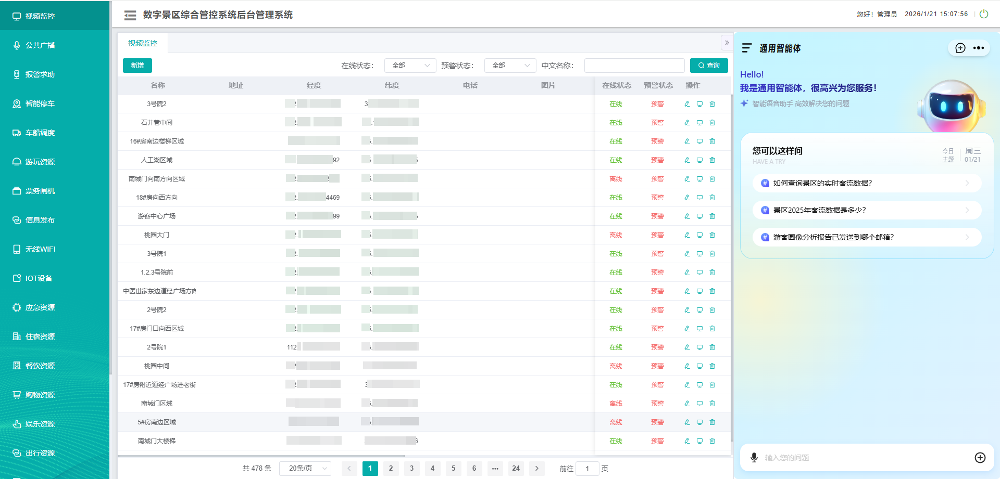
</div>

#### 4、移动端交互智能体
在移动设备上，用户可以通过语音或文字与智能体进行交互，实现信息查询、任务管理、智能提醒等功能，成为用户的便携式个人助理。

<p align="center">
  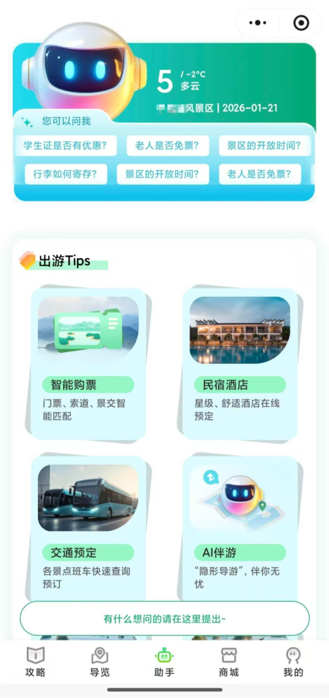
  &nbsp;&nbsp;&nbsp;&nbsp;
  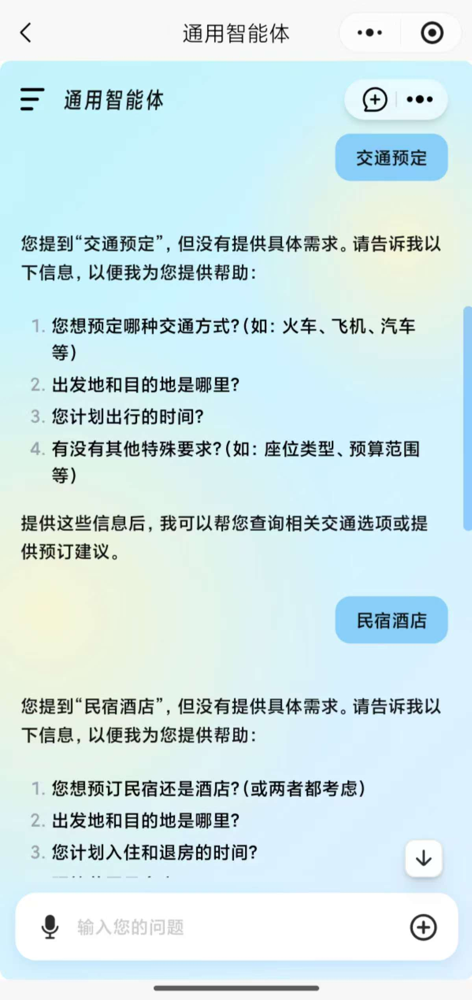
</p>

#### 5、移动端管理智能体
将 Agenta 智能体以悬浮窗或内嵌聊天窗口的形式集成到现有移动应用中。当用户在应用内遇到问题时，可随时唤醒智能体，实现即时问答和业务引导，提升用户体验。


<p align="center">
    
    &nbsp;&nbsp;&nbsp;&nbsp;
    
</div>

## 交互开发

本系统基于 Flask + Socket.IO 技术,通过 WebSocket 实现前后端实时通信。外部系统可以通过 WebSocket 连接本系统,实现页面跳转、数据查询、增删改查等操作。

### 核心功能

- **页面路由跳转**: 支持页面的智能跳转
- **数据查询**: 实时查询并反馈页面数据
- **数据操作**: 支持新增、修改、删除操作
- **数字人集成**: 支持数字人播报完成反馈
- **智能等待机制**: 通过wait_id实现后端与前端的同步等待（最长300秒）

### 配置信息

外部系统接入本系统需要配置以下信息：

| 配置项 | 说明 | 示例 |
|--------|------|------|
| **WebSocket地址** | Socket.IO服务地址 | `ws://127.0.0.1:5001` |
| **数字人地址** | 数字人服务API（可选） | `https://dh.example.com/api/digitalhuman-chat` |
| **聊天框地址** | 前端聊天界面（可选） | `https://chat.example.com/chat` |

### 调用流程

#### 1. 连接初始化流程

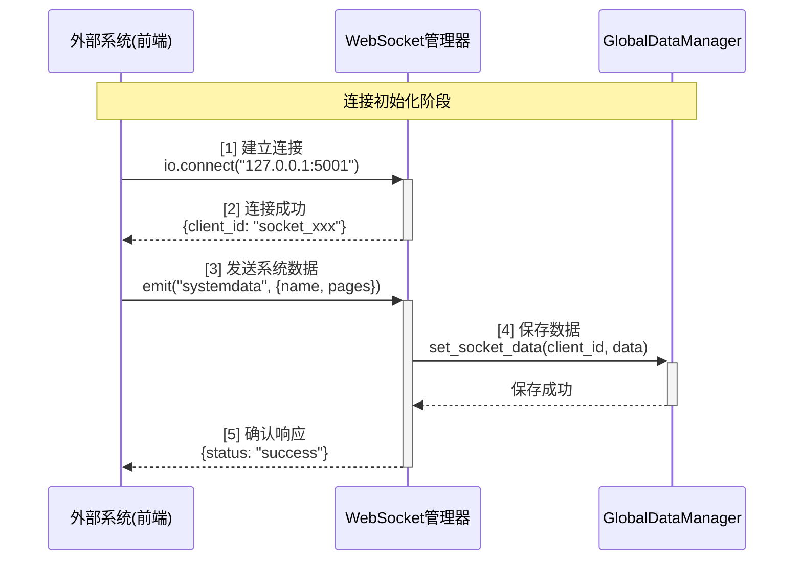

#### 2. 页面跳转流程

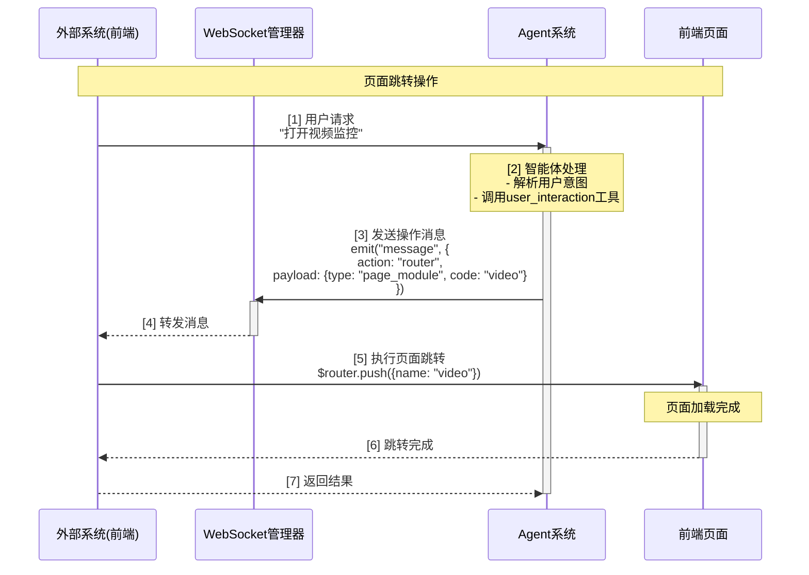

#### 3. 数据查询流程（带等待机制）

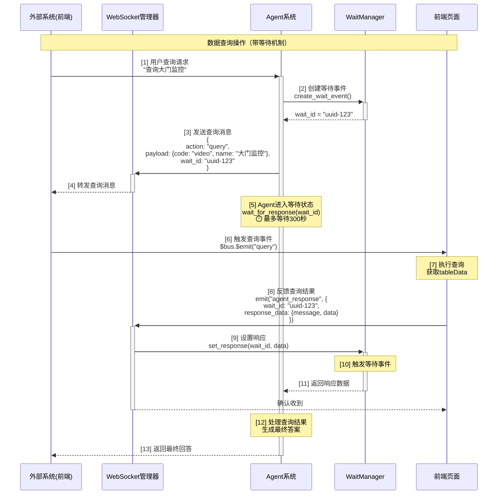

#### 4 数字人交互流程

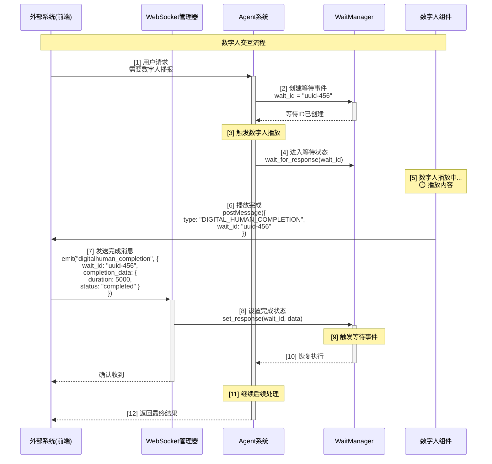

### JSON消息格式

#### 后端 → 前端消息

**1. 页面跳转 (router)**
```json
{
  "action": "router",
  "payload": {
    "type": "page_module",
    "code": "video"
  },
  "wait_id": "optional-uuid"
}
```

**2. 数据查询 (query)**
```json
{
  "action": "query",
  "payload": {
    "type": "page_module",
    "code": "video",
    "name": "大门监控"
  },
  "wait_id": "uuid-123"
}
```

**3. 新增数据 (add)**
```json
{
  "action": "add",
  "payload": {
    "type": "setting_module",
    "code": "video",
    "form": {
      "name": "新监控点",
      "latitude": "30.123",
      "longitude": "120.456"
    }
  },
  "wait_id": "uuid-456"
}
```

**4. 修改数据 (modify)**
```json
{
  "action": "modify",
  "payload": {
    "type": "page_module",
    "code": "video",
    "oldname": "原名称",
    "form": {
      "name": "新名称"
    }
  },
  "wait_id": "uuid-789"
}
```

**5. 删除数据 (delete)**
```json
{
  "action": "delete",
  "payload": {
    "type": "page_module",
    "code": "video",
    "name": "要删除的名称"
  },
  "wait_id": "uuid-abc"
}
```

#### 前端 → 后端消息

**1. 系统数据上传 (systemdata)**
```json
{
  "name": "智慧景区系统",
  "userinfo": {
    "destination_id": "scenic_001"
  },
  "type": "page_module",
  "description": "景区管理平台",
  "pages": [
    {
      "code": "video",
      "name": "视频监控",
      "description": "监控点位管理"
    }
  ]
}
```

**2. Agent响应反馈 (agent_response)**
```json
{
  "wait_id": "uuid-123",
  "response_data": {
    "message": "查询操作完成",
    "data": {
      "total": 10,
      "list": []
    },
    "is_summarize": true
  }
}
```

**3. 数字人完成通知 (digitalhuman_completion)**
```json
{
  "wait_id": "uuid-456",
  "completion_data": {
    "duration": 5000,
    "status": "completed",
    "message": "数字人讲话已完成"
  }
}
```

### 接入代码示例

```javascript
import io from "socket.io-client";

// 1. 建立WebSocket连接
const socket = io("ws://127.0.0.1:5001");

// 2. 连接成功处理
socket.on("connect", () => {
  socket.emit("systemdata", {
    name: "智慧景区系统",
    type: "page_module",
    pages: [{ code: "video", name: "视频监控" }]
  });
});

// 3. 接收后端操作消息
socket.on("message", (data) => {
  if (data.wait_id) {
    sessionStorage.setItem("wait_id", data.wait_id);
  }
  
  switch(data.action) {
    case "router": handleRouter(data); break;
    case "query": handleQuery(data); break;
  }
});

// 4. 反馈结果给后端
function sendAgentResponse(responseData) {
  const waitId = sessionStorage.getItem("wait_id");
  if (waitId) {
    socket.emit('agent_response', {
      wait_id: waitId,
      response_data: responseData
    });
    sessionStorage.removeItem("wait_id");
  }
}
```

## 🤝交流与社区

我们热情欢迎所有开发者和用户加入我们的社区！在这里，你可以自由提问、分享经验、贡献代码，共同推动项目的发展。

<div align="center">

| 微信交流群 | &nbsp;&nbsp;&nbsp;&nbsp; | QQ 交流群 |
|:--:|:--:|:--:|
|  | &nbsp;&nbsp; |  |
| 扫码加入微信技术交流群 | &nbsp;&nbsp; | 扫码或搜索群号 `123456789` 加入 |

</div>

**更多链接:**

- **报告问题与建议 (Issues):** 前往 [GitHub Issues](https://github.com/winyeahs/agenta/issues) 提交您发现的 Bug 或功能建议。
- **参与讨论 (Discussions):** 加入我们的 [GitHub Discussions](https://github.com/winyeahs/agenta/discussions) 进行更深入的技术探讨和想法交流。
- **联系我们 (Contact):** 如有商务合作或其他事宜，请发送邮件至 `[your-official-email@example.com]`。

