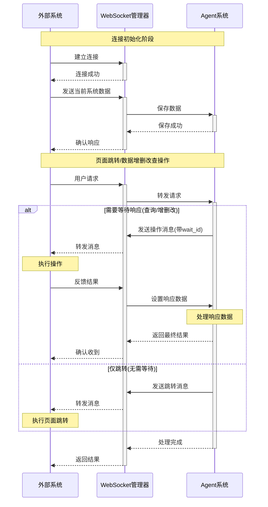

<div align="center" style="padding: 3.125rem;">

<h1 style="color: #007bff;">Agenta</h1>

<a href="https://github.com/winyeahs/agenta/stargazers">
  
</a>
<a href="https://github.com/winyeahs/agenta/blob/main/LICENSE">
  
</a>
<a href="https://www.python.org/">
  
</a>
<a href="https://nodejs.org/">
  
</a>
<a href="https://github.com/winyeahs/agenta#部署指南">
  
</a>
<a href="https://github.com/winyeahs/agenta/issues">
  
</a>
<a href="https://github.com/winyeahs/agenta/pulls">
  
</a>
<a href="https://github.com/winyeahs/agenta/commits/main">
  
</a>

</div>


本项目是一个前后端分离的、功能强大的智能体应用开发平台。它深度集成了大型语言模型（LLM）、数字人、多模态能力和外部工具，旨在提供一个灵活、可扩展的框架，用于快速构建和部署复杂的 AI 应用。

平台的核心是一个基于 Agent 的架构，允许开发者创建、管理和编排不同的智能体，每个智能体都可以拥有自己的模型、工具和知识库。

## Summary

- [快速开始](#快速开始)
- [目录结构](#目录结构)
- [功能展示](#功能展示)
- [使用场景](#使用场景)
- [交互开发](#交互开发)
- [交流与社区](#交流与社区)

## 快速开始

以下是在本地开发环境快速启动项目的步骤。

### 安装环境

确保本地已安装：
- Python 3.12+
- Node.js 22.11+
- MySQL, Redis, Milvus (向量数据库)

#### 1. 启动后端 (API)

```bash
cd api

# 1. 创建并激活虚拟环境 (推荐)
  #安装 uv 包管理器
  pip install uv

  #创建虚拟环境
  uv venv

  #激活虚拟环境
  # Windows:
  venv\Scripts\activate
  # Linux/macOS:
  source .venv/bin/activate

# 2. 安装依赖
  uv pip install -r requirements.txt

# 3. 同步环境（可选）
  uv pip sync requirements.txt

# 4. 配置环境变量
  # 进入env文件，配置数据库、Milvus向量数据库、大模型、向量化API等相关数据
  cp .env

# 5. 启动MCP服务
  cd mcp/
  用git bash 运行 start.sh 脚本

# 6. 启动数字人服务
  cd digitalhuman/
  python app.py

# 6. 回到后端根目录/api，启动后端服务
  python app.py
```

#### 2. 启动前端 (Web)

```bash
  cd web

# 1. 安装依赖
  pnpm install

# 2. 配置环境变量
  # 进入env文件，配置后端基础地址等相关数据
  cp .env

# 3. 启动开发服务器
  pnpm dev
```

前端服务将在 `http://localhost:3000` 运行。

### 配置说明

项目的配置主要通过 **环境变量** 进行管理，详细请看.ven文件内配置说明。

#### 后端 (`api/.env`)

后端启动时会加载根目录下的 `.env` 文件。关键配置项包括：

-   `FLASK_ENV`: 运行环境 (`development` 或 `production`)。
-   `SECRET_KEY`: Flask 应用的密钥。
-   `ALLOWED_ORIGINS`: CORS 允许的跨域来源列表，用逗号分隔。
-   **数据库配置**:
    -   `DB_USERNAME`, `DB_PASSWORD`, `DB_HOST`, `DB_PORT`, `DB_NAME`
-   **Milvus向量数据库配置**:
    -   `MILVUS_HOST`, `MILVUS_PORT`, `MILVUS_DB`, `MILVUS_USER`, `MILVUS_PASSWORD`
-   **知识图谱数据库配置**:
    -   `NEO4J_URL`, `NEO4J_USERNAME`, `NEO4J_USERNAME`
-   **MCP 初始化超时**:
    -   `MCP_INIT_TIMEOUT`: MCP 服务启动的超时时间（秒）。

#### 前端 (`web/.env`)

前端关键配置包括：

-   `NEXT_PUBLIC_API_BASE_URL`: 后端 API 的地址。
-   `NEXT_PUBLIC_SOCKET_URL`: Socket.IO 服务的地址。
-   `NEXT_PUBLIC_DIGITAL_HUMAN_URL`: 数字人服务的地址。
-   `NEXT_PUBLIC_MAP_URL`: 地图服务的 URL。


#### MCP 服务配置 (`mcp/`)

MCP (Model Context Protocol) 是一个标准的工具调用协议，允许 Agent 发现并调用外部工具。在本项目中，它用于将各种能力（如发送邮件、操作Excel、生成图表）封装为 Agent 可用的标准化服务。

-   **服务启动**:
    -   所有 MCP 服务都由根目录下的 `mcp/start.sh` 脚本统一启动。在启动主后端应用之前，必须先运行此脚本。
    -   该脚本会并行启动 `mcp-server-chart`、`mcp-email-docker` 和 `excel-mcp-server` 等多个独立服务。


### 目录结构

```
.
├── api/                # 后端 Flask 应用
│   ├── controllers/    # API 路由和控制器
│   ├── core/           # 核心业务逻辑 (Agent, MCP, RAG, Mem0)
│   ├── database/       # 数据库脚本
│   ├── models/         # SQLAlchemy 数据模型
│   ├── services/       # 业务逻辑服务层
│   ├── tools/          # Agent 可用的工具
│   ├── factory.py      # Flask 应用工厂
│   ├── requirements.txt # Python 依赖
│   └── Dockerfile      # 后端 Dockerfile
├── web/                # 前端 Next.js 应用
│   ├── app/            # Next.js App Router
│   ├── components/     # React 组件
│   ├── config/         # 前端配置文件
│   ├── service/        # API 请求服务
│   ├── store/          # Zustand 状态管理
│   ├── package.json    # Node.js 依赖
│   └── Dockerfile      # 前端 Dockerfile
├── digitalhuman/       # 数字人服务
├── mcp/                # MCP (Model Context Protocol) 服务
│   ├── mcp-email-docker/ # 邮件 MCP 服务
│   └── ...
└── README.md      # 本文档
```

## 功能展示

#### 1、智能体应用管理:
支持创建、配置和管理多个智能体应用，每个智能体应用都有自己单独的mcp与知识库等配置。
<div align="center">
  
</div>

#### 2、多模型支持:
可接入并切换不同的 LLM (如 阿里百炼, DeepSeek, Doubao 等)。
<div align="center">
  
  <br>
  
</div>

#### 3、丰富交互卡片:
支持以结构化的卡片形式展示天气、报告等复杂信息，提升交互体验。
<div align="center">
  
</div>

#### 4、MCP工具 (Model Context Protocol):
一个标准的工具调用协议，可以接入多种外部工具（如发送邮件、操作 Excel、生成图表等）封装成 Agent 可调用的标准化工具。
<div align="center">
  
</div>

#### 5、知识库
可以添加多种知识库，如文档、数据库、API等，用于Agent的知识库检索。
<div align="center">
  
</div>

#### 6、数字人集成:
可绑定多种数字人样式，支持与实时数字人进行音视频交互。
<div align="center">
  
</div>
  
#### 7、数字员工:
内置定时任务系统，可用于执行周期性或特定时期任务等。
<div align="center">
  
</div>


## 使用场景

#### 1、数字人讲解智能体
直接与数字人语音交互，实现实时讲解和问答。可扩展作为虚拟主播进行直播、在展会或营业厅作为数字人向导提供信息、或作为AI教师进行在线教育。

<div align="center">
  
</div>

#### 2、企业客服智能体
利用聊天、知识库（RAG）和卡片展示能力，构建能准确回答客户问题、引导用户操作的智能客服系统。

<div align="center">
  
</div>


#### 3、系统交互智能体
通过智能体聊天页面与系统进行交互，实现对网页页面的智能感知，简单操作与数据分析回答等功能。

<div align="center">
  
</div>

#### 4、移动端交互智能体
在移动设备上，用户可以通过语音或文字与智能体进行交互，实现信息查询、任务管理、智能提醒等功能，成为用户的便携式个人助理。

<p align="center">
  
  &nbsp;&nbsp;&nbsp;&nbsp;
  
</p>

#### 5、移动端管理智能体
将 Agenta 智能体以悬浮窗或内嵌聊天窗口的形式集成到现有移动应用中。当用户在应用内遇到问题时，可随时唤醒智能体，实现即时问答和业务引导，提升用户体验。


<p align="center">
    
    &nbsp;&nbsp;&nbsp;&nbsp;
    
</div>

## 交互开发

外部系统可集成此智能体应用，以数字人或聊天对话的形式实现智能交互，支持自动页面跳转、数据查询及增删改查等操作。

### 核心功能

- **页面路由跳转**: 支持页面的智能跳转
- **数据查询**: 实时查询并反馈页面数据
- **数据操作**: 支持新增、修改、删除操作
- **数字人集成**: 支持数字人形式的语音交互操作
- **聊天页面集成**: 支持通过聊天页对外部系统进行智能交互

### 配置信息

外部系统接入本系统需要配置以下信息：

| 配置项 | 说明 | 示例 |
|--------|------|------|
| **WebSocket地址** | Socket.IO服务地址 | `ws://127.0.0.1:5001` |
| **数字人地址** | 数字人服务API（可选） | `https://dh.example.com/api/digitalhuman-chat` |
| **聊天框地址** | 前端聊天界面（可选） | `https://chat.example.com/chat` |

### 调用流程

#### 系统交互流程



### 调用说明

#### 1、初始化，建立连接

```javascript
import io from "socket.io-client";  // 使用 socket.io-client 库

// 连接 WebSocket
const socket = io("127.0.0.1:5001");  //使用配置的WebSocket地址
window.socket = socket;
```

#### 2、连接回调

```javascript
//初始化连接成功处理
socket.on("connect", () => {
  console.log("连接成功");
  
  // 外部系统回传系统配置数据，用于区分系统信息
  socket.emit("systemdata", {
    name: "系统名称",
    userinfo: {
      destination_id: "目的地ID"
    },
    type: "page_module",
    description: "系统描述",
    pages: [/* 回传可操作的页面配置数组 */]
  });
});

//初始化连接错误处理
socket.on("connect_error", (err) => {
  console.log("连接错误:", err);
});

socket.on("disconnect", () => {
  console.log("连接断开");
});
```
<br>

#### JSON消息格式与类型
agent返回给前端的json格式，根据此信息进行增删改查和路由跳转处理
```javascript
// 返回的操作类型包括增删改查和页面路由跳转
{
  action: "操作类型",      // router/query/add/modify/delete
  payload: {
    type: "模块类型",      // page_module/setting_module
    code: "页面代码",      // 如: video, pandect, carpark
    // ...其他参数
  },
  wait_id: "等待ID"       // 可选，用于数据反馈
}

//示例：
//页面跳转
{
  "action": "router",
  "payload": {
    "type": "page_module",
    "code": "video"  //跳转到的页面
  },
  "wait_id": "optional-uuid"
}
//数据查询
{
  "action": "query",
  "payload": {
    "type": "page_module",
    "code": "video",
    "name": "大门监控"
  },
  "wait_id": "uuid-123"
}
//新增数据
{
  "action": "add",
  "payload": {
    "type": "setting_module",
    "code": "video",
    "form": {
      "name": "新监控点",
      "latitude": "30.123",
      "longitude": "120.456"
    }
  },
  "wait_id": "uuid-456"
}
//修改数据
{
  "action": "modify",
  "payload": {
    "type": "page_module",
    "code": "video",
    "oldname": "原名称",
    "form": {
      "name": "新名称"
    }
  },
  "wait_id": "uuid-789"
}
//删除数据
{
  "action": "delete",
  "payload": {
    "type": "page_module",
    "code": "video",
    "name": "要删除的名称"
  },
  "wait_id": "uuid-abc"
}
```

#### 外部系统接收消息处理逻辑
```javascript
//路由跳转处理
socket.on("message", (data) => {
  if (data.action === "router") {
    if (data.payload.type === "page_module") {
      const targetRouteName = data.payload.code;
      
      // 跳转页面
      window.this.$refs.bottombar.getTo(targetRouteName);
      window.this.$router.push({
        name: targetRouteName
      });
      
      // 标记页面加载状态
      window.pageLoadingStatus = { [targetRouteName]: false };
      
      // 提示用户
      setTimeout(() => {
        window.this.$message.success("AI正在为你处理，已成功跳转相应页面");
      }, 500);
    }
  }
});

//查询处理
socket.on("message", (data) => {
  if (data.action === "query") {
    // 检查页面是否准备好
    const checkPageReady = () => {
      const targetCode = data.payload.code;
      const isCurrentPage = window.this.$route.name === targetCode;
      const isPageReady = window.pageLoadingStatus?.[targetCode];
      
      if (isCurrentPage && isPageReady) {
        // 触发查询事件
        window.this.$bus.$emit("query", data);
      } else {
        // 延迟重试
        setTimeout(checkPageReady, 500);
      }
    };
    
    setTimeout(checkPageReady, 1500);
  }
});
// 在页面组件中监听 query 事件
mounted() {
  this.$bus.$on("query", this.handleQuery);
},
methods: {
  handleQuery(data) {
    // 检查是否是当前页面
    if (data.payload.code !== this.$route.name) return;
    
    // 设置搜索关键字
    this.searchKey = data.payload.name;
    
    // 执行查询
    this.onQuery();
    
    // 反馈结果
    if (window.sessionStorage.getItem("wait_id")) {
      setTimeout(() => {
        window.sendAgentResponse({
          message: "查询操作完成",
          data: this.tableData  // 返回查询结果
        });
      }, 1000);
    }
  }
}

//新增处理
methods: {
  handleAdd(data) {
    if (data.payload.code !== this.$route.name) return;
    
    // 打开新增表单
    this.handleAdd();
    
    // 填充表单数据
    setTimeout(() => {
      this.form = data.payload.form || {};
      
      // 反馈结果
      if (window.sessionStorage.getItem("wait_id")) {
        setTimeout(() => {
          window.sendAgentResponse({
            message: "添加操作完成",
            data: ""
          });
        }, 1000);
      }
    }, 1000);
  }
}

//修改处理
methods: {
  handleModify(data) {
    if (data.payload.code !== this.$route.name) return;
    
    // 先查询原记录
    this.searchKey = data.payload.oldname;
    this.onQuery();
    
    setTimeout(() => {
      if (this.tableData.length === 0) return;
      
      // 打开编辑表单
      let oldData = this.tableData[0];
      this.editRow(oldData);
      
      // 更新表单数据
      setTimeout(() => {
        let newForm = data.payload.form;
        Object.keys(newForm).forEach(key => {
          if (this.form.hasOwnProperty(key)) {
            this.form[key] = newForm[key];
          }
        });
        
        // 反馈结果
        if (window.sessionStorage.getItem("wait_id")) {
          setTimeout(() => {
            window.sendAgentResponse({
              message: "修改操作完成",
              data: ""
            });
          }, 1000);
        }
      }, 1000);
    }, 1000);
  }
}

//删除处理
methods: {
  handleDelete(data) {
    if (data.payload.code !== this.$route.name) return;
    
    // 先查询记录
    this.searchKey = data.payload.name;
    this.onQuery();
    
    setTimeout(() => {
      if (this.tableData.length === 0) return;
      
      let oldData = this.tableData[0];
      
      // 弹出确认框
      this.$confirm('确定删除这条数据吗？', '提示', {
        confirmButtonText: '确定',
        cancelButtonText: '取消',
        type: 'warning'
      }).then(() => {
        // 执行删除
        this.delRow(oldData);
        
        // 反馈结果
        if (window.sessionStorage.getItem("wait_id")) {
          setTimeout(() => {
            window.sendAgentResponse({
              message: "删除操作完成",
              data: ""
            });
          }, 1000);
        }
      }).catch(() => {
        // 用户取消
        if (window.sessionStorage.getItem("wait_id")) {
          window.sendAgentResponse({
            message: "删除操作取消",
            data: ""
          });
        }
      });
    }, 1000);
  }
}
```

### 数据反馈机制

#### 1. wait_id 机制

后端发送消息时会携带 `wait_id`，前端处理完成后需要通过此 ID 反馈结果。

```javascript
// 保存 wait_id
if (data.wait_id) {
  window.sessionStorage.setItem("wait_id", data.wait_id);
  window.sessionStorage.setItem("code", data.payload.code);
}
```

#### 2. 发送反馈

```javascript
// 全局反馈方法
window.sendAgentResponse = (responseData) => {
  const waitId = window.sessionStorage.getItem("wait_id");
  
  if (waitId && window.socket && window.socket.connected) {
    window.socket.emit('agent_response', {
      wait_id: waitId,
      response_data: responseData
    });
    
    console.log("📤 已发送数据反馈给后端:", responseData);
    
    // 清除缓存
    window.sessionStorage.removeItem("wait_id");
    window.sessionStorage.removeItem("code");
  }
};
```

#### 3. 反馈数据格式

```javascript
{
  message: "操作描述",
  data: {
    // 返回的数据，如查询结果
  },
  is_summarize: true  // 可选，是否需要总结
}
```

#### 4. 使用示例

```javascript
// 查询完成后反馈
window.sendAgentResponse({
  message: "查询操作完成",
  data: {
    total: 10,
    list: [/* 查询结果 */]
  }
});

// 新增完成后反馈
window.sendAgentResponse({
  message: "添加操作完成",
  data: ""
});

// 修改完成后反馈
window.sendAgentResponse({
  message: "修改操作完成",
  data: ""
});

// 删除完成后反馈
window.sendAgentResponse({
  message: "删除操作完成",
  data: ""
});
```

### 数字人集成

#### 1. 数字人完成消息

前端通过 `postMessage` 发送数字人完成消息：

```javascript
window.postMessage({
  type: 'DIGITAL_HUMAN_COMPLETION',
  wait_id: waitId,
  completion_data: {
    duration: 5000,  // 播放时长（毫秒）
    status: 'completed',
    message: '数字人讲话已完成'
  }
}, '*');
```

#### 2. WebSocket 监听并转发

```javascript
window.addEventListener('message', (event) => {
  if (event.data && event.data.type === 'DIGITAL_HUMAN_COMPLETION') {
    console.log("📥 收到数字人完成消息:", event.data);
    
    if (socket && socket.connected) {
      socket.emit('digitalhuman_completion', {
        wait_id: event.data.wait_id,
        completion_data: event.data.completion_data
      });
      
      console.log("📤 已通过socket发送数字人完成消息给后端");
    }
  }
});
```

## 🤝交流与社区

我们热情欢迎所有开发者和用户加入我们的社区！在这里，你可以自由提问、分享经验、贡献代码，共同推动项目的发展。

<div align="center">

| 微信交流群 | &nbsp;&nbsp;&nbsp;&nbsp; | QQ 交流群 |
|:--:|:--:|:--:|
|  | &nbsp;&nbsp; |  |
| 扫码加入微信技术交流群 | &nbsp;&nbsp; | 扫码或搜索群号 `123456789` 加入 |

</div>

**更多链接:**

- **报告问题与建议 (Issues):** 前往 [GitHub Issues](https://github.com/winyeahs/agenta/issues) 提交您发现的 Bug 或功能建议。
- **参与讨论 (Discussions):** 加入我们的 [GitHub Discussions](https://github.com/winyeahs/agenta/discussions) 进行更深入的技术探讨和想法交流。
- **联系我们 (Contact):** 如有商务合作或其他事宜，请发送邮件至 `[your-official-email@example.com]`。

