<div align="center" style="padding: 3.125rem;">
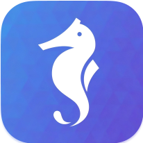
<h1 style="color: #007bff;">Agenta</h1>

<a href="https://github.com/winyeahs/agenta/stargazers">
  
</a>
<a href="https://github.com/winyeahs/agenta/blob/main/LICENSE">
  
</a>
<a href="https://www.python.org/">
  
</a>
<a href="https://nodejs.org/">
  
</a>
<a href="https://github.com/winyeahs/agenta#部署指南">
  
</a>
<a href="https://github.com/winyeahs/agenta/issues">
  
</a>
<a href="https://github.com/winyeahs/agenta/pulls">
  
</a>
<a href="https://github.com/winyeahs/agenta/commits/main">
  
</a>

</div>


本项目是一个前后端分离的、功能强大的智能体应用开发平台。它深度集成了大型语言模型（LLM）、数字人、多模态能力和外部工具，旨在提供一个灵活、可扩展的框架，用于快速构建和部署复杂的 AI 应用。

平台的核心是一个基于 Agent 的架构，允许开发者创建、管理和编排不同的智能体，每个智能体都可以拥有自己的模型、工具和知识库。

## Summary

- [快速开始](#快速开始)
- [目录结构](#目录结构)
- [功能展示](#功能展示)
- [使用场景](#使用场景)
- [交互开发](#交互开发)
- [交流与社区](#交流与社区)

## 快速开始

以下是在本地开发环境快速启动项目的步骤。

### 安装环境

确保本地已安装：
- Python 3.12+
- Node.js 22.11+
- MySQL, Redis, Milvus (向量数据库)

#### 1. 启动后端 (API)

```bash
cd api

# 1. 创建并激活虚拟环境 (推荐)
  #安装 uv 包管理器
  pip install uv

  #创建虚拟环境
  uv venv

  #激活虚拟环境
  # Windows:
  venv\Scripts\activate
  # Linux/macOS:
  source .venv/bin/activate

# 2. 安装依赖
  uv pip install -r requirements.txt

# 3. 同步环境（可选）
  uv pip sync requirements.txt

# 4. 配置环境变量
  # 进入env文件，配置数据库、Milvus向量数据库、大模型、向量化API等相关数据
  cp .env

# 5. 启动MCP服务
  cd mcp/
  用git bash 运行 start.sh 脚本

# 6. 启动数字人服务
  cd digitalhuman/
  python app.py

# 6. 回到后端根目录/api，启动后端服务
  python app.py
```

#### 2. 启动前端 (Web)

```bash
  cd web

# 1. 安装依赖
  pnpm install

# 2. 配置环境变量
  # 进入env文件，配置后端基础地址等相关数据
  cp .env

# 3. 启动开发服务器
  pnpm dev
```

前端服务将在 `http://localhost:3000` 运行。

### 配置说明

项目的配置主要通过 **环境变量** 进行管理，详细请看.ven文件内配置说明。

#### 后端 (`api/.env`)

后端启动时会加载根目录下的 `.env` 文件。关键配置项包括：

-   `FLASK_ENV`: 运行环境 (`development` 或 `production`)。
-   `SECRET_KEY`: Flask 应用的密钥。
-   `ALLOWED_ORIGINS`: CORS 允许的跨域来源列表，用逗号分隔。
-   **数据库配置**:
    -   `DB_USERNAME`, `DB_PASSWORD`, `DB_HOST`, `DB_PORT`, `DB_NAME`
-   **Milvus向量数据库配置**:
    -   `MILVUS_HOST`, `MILVUS_PORT`, `MILVUS_DB`, `MILVUS_USER`, `MILVUS_PASSWORD`
-   **知识图谱数据库配置**:
    -   `NEO4J_URL`, `NEO4J_USERNAME`, `NEO4J_USERNAME`
-   **MCP 初始化超时**:
    -   `MCP_INIT_TIMEOUT`: MCP 服务启动的超时时间（秒）。

#### 前端 (`web/.env`)

前端关键配置包括：

-   `NEXT_PUBLIC_API_BASE_URL`: 后端 API 的地址。
-   `NEXT_PUBLIC_SOCKET_URL`: Socket.IO 服务的地址。
-   `NEXT_PUBLIC_DIGITAL_HUMAN_URL`: 数字人服务的地址。
-   `NEXT_PUBLIC_MAP_URL`: 地图服务的 URL。


#### MCP 服务配置 (`mcp/`)

MCP (Model Context Protocol) 是一个标准的工具调用协议，允许 Agent 发现并调用外部工具。在本项目中，它用于将各种能力（如发送邮件、操作Excel、生成图表）封装为 Agent 可用的标准化服务。

-   **服务启动**:
    -   所有 MCP 服务都由根目录下的 `mcp/start.sh` 脚本统一启动。在启动主后端应用之前，必须先运行此脚本。
    -   该脚本会并行启动 `mcp-server-chart`、`mcp-email-docker` 和 `excel-mcp-server` 等多个独立服务。


### 目录结构

```
.
├── api/                # 后端 Flask 应用
│   ├── controllers/    # API 路由和控制器
│   ├── core/           # 核心业务逻辑 (Agent, MCP, RAG, Mem0)
│   ├── database/       # 数据库脚本
│   ├── models/         # SQLAlchemy 数据模型
│   ├── services/       # 业务逻辑服务层
│   ├── tools/          # Agent 可用的工具
│   ├── factory.py      # Flask 应用工厂
│   ├── requirements.txt # Python 依赖
│   └── Dockerfile      # 后端 Dockerfile
├── web/                # 前端 Next.js 应用
│   ├── app/            # Next.js App Router
│   ├── components/     # React 组件
│   ├── config/         # 前端配置文件
│   ├── service/        # API 请求服务
│   ├── store/          # Zustand 状态管理
│   ├── package.json    # Node.js 依赖
│   └── Dockerfile      # 前端 Dockerfile
├── digitalhuman/       # 数字人服务
├── mcp/                # MCP (Model Context Protocol) 服务
│   ├── mcp-email-docker/ # 邮件 MCP 服务
│   └── ...
└── README.md      # 本文档
```

## 功能展示

#### 1、智能体应用管理:
支持创建、配置和管理多个智能体应用，每个智能体应用都有自己单独的mcp与知识库等配置。
<div align="center">
  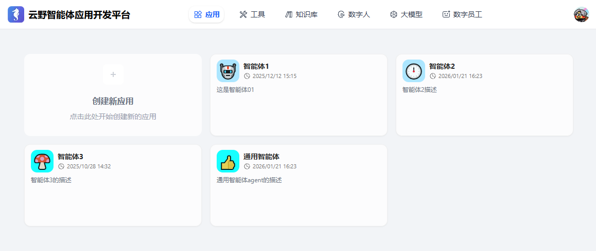
</div>

#### 2、多模型支持:
可接入并切换不同的 LLM (如 阿里百炼, DeepSeek, Doubao 等)。
<div align="center">
  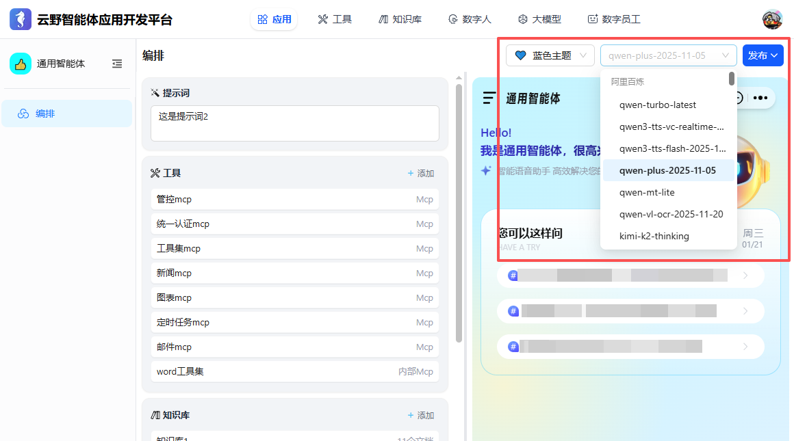
  <br>
  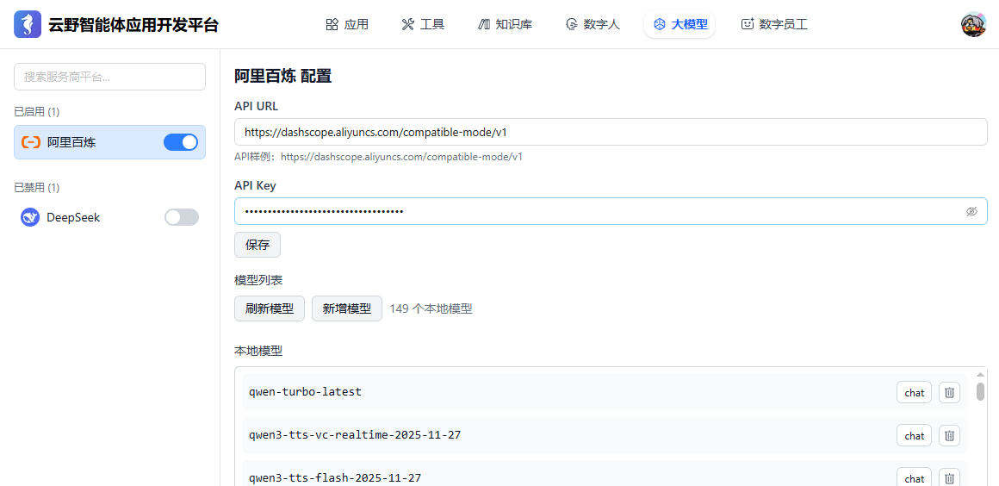
</div>

#### 3、丰富交互卡片:
支持以结构化的卡片形式展示天气、报告等复杂信息，提升交互体验。
<div align="center">
  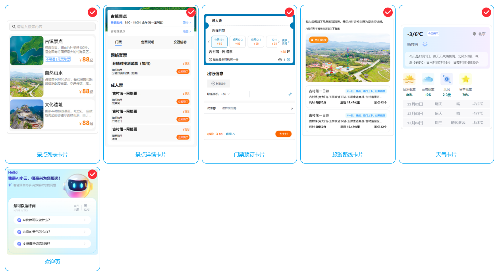
</div>

#### 4、MCP工具 (Model Context Protocol):
一个标准的工具调用协议，可以接入多种外部工具（如发送邮件、操作 Excel、生成图表等）封装成 Agent 可调用的标准化工具。
<div align="center">
  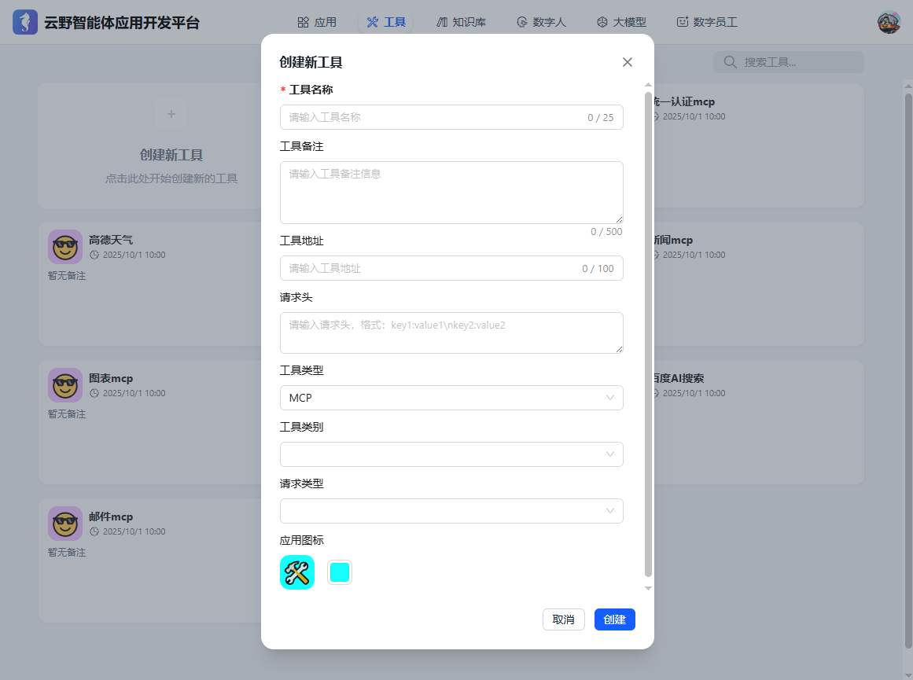
</div>

#### 5、知识库
可以添加多种知识库，如文档、数据库、API等，用于Agent的知识库检索。
<div align="center">
  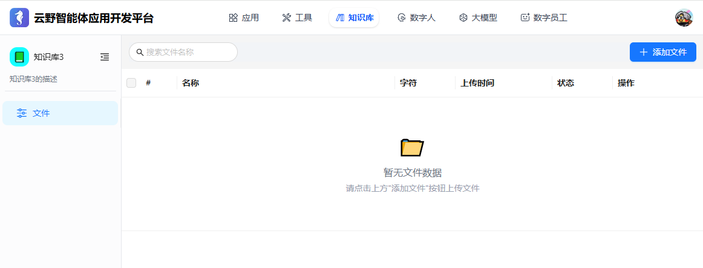
</div>

#### 6、数字人集成:
可绑定多种数字人样式，支持与实时数字人进行音视频交互。
<div align="center">
  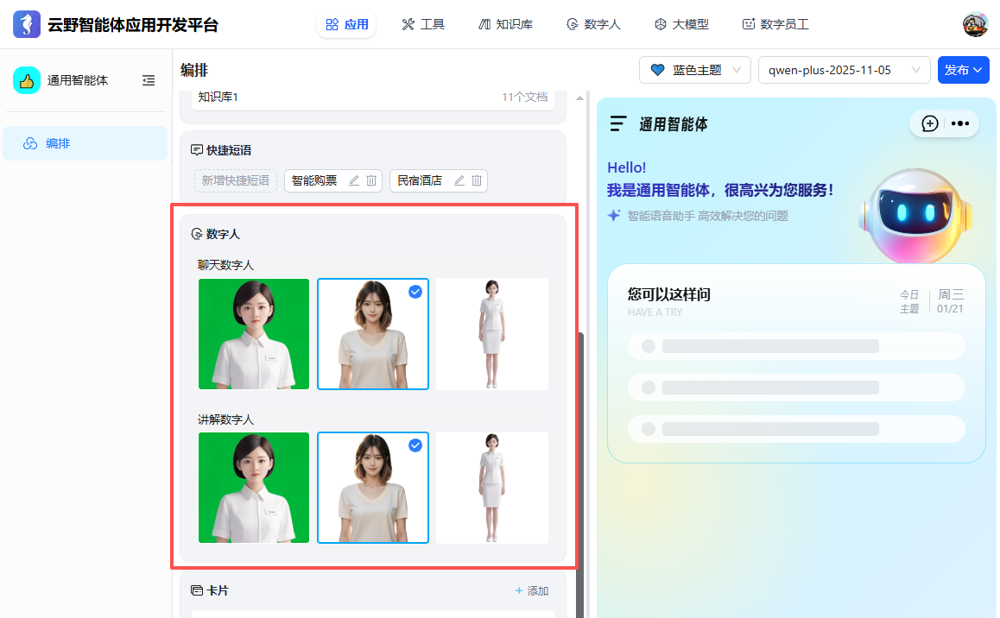
</div>
  
#### 7、数字员工:
内置定时任务系统，可用于执行周期性或特定时期任务等。
<div align="center">
  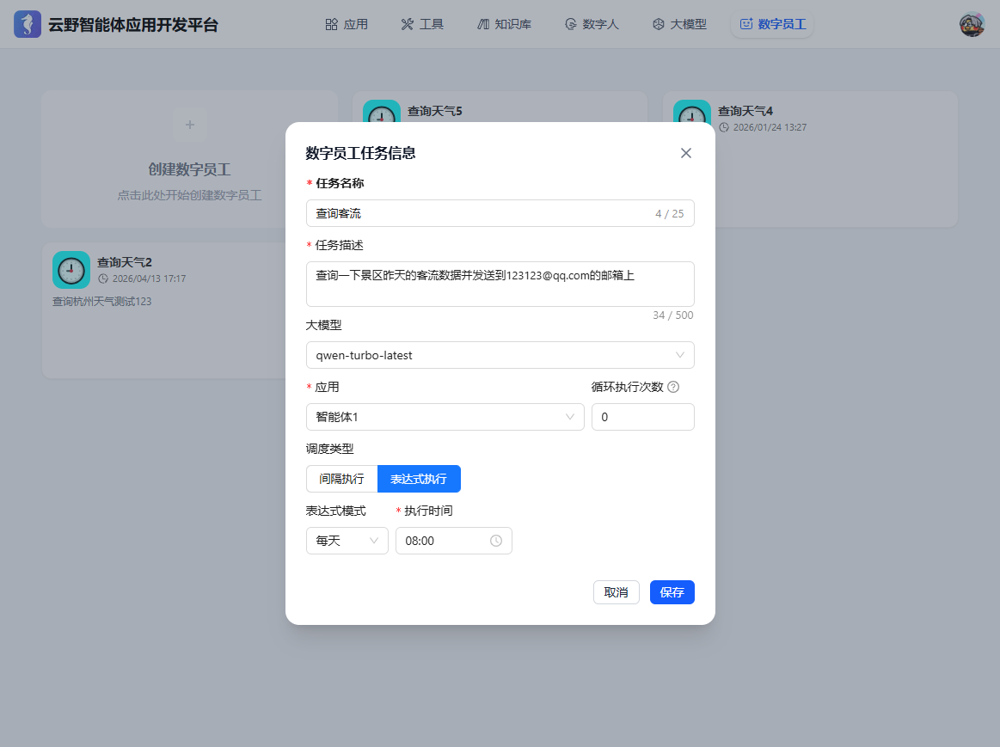
</div>


## 使用场景

#### 1、数字人讲解智能体
直接与数字人语音交互，实现实时讲解和问答。可扩展作为虚拟主播进行直播、在展会或营业厅作为数字人向导提供信息、或作为AI教师进行在线教育。

<div align="center">
  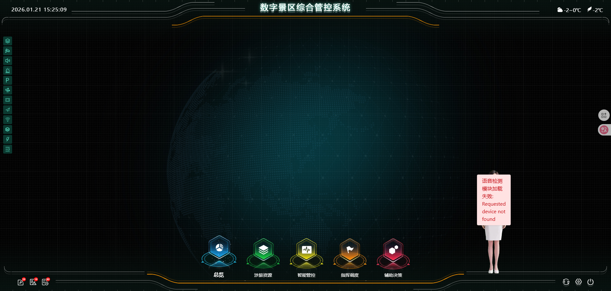
</div>

#### 2、企业客服智能体
利用聊天、知识库（RAG）和卡片展示能力，构建能准确回答客户问题、引导用户操作的智能客服系统。

<div align="center">
  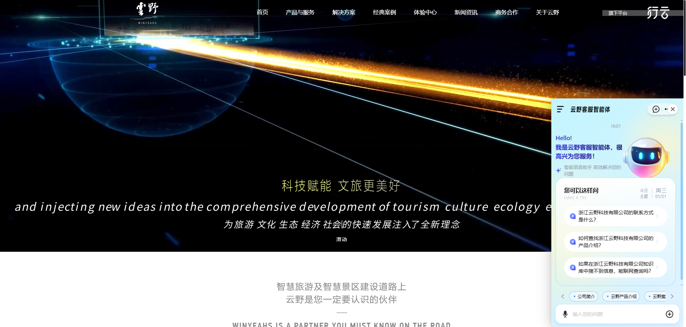
</div>


#### 3、系统交互智能体
通过智能体聊天页面与系统进行交互，实现对网页页面的智能感知，简单操作与数据分析回答等功能。

<div align="center">
  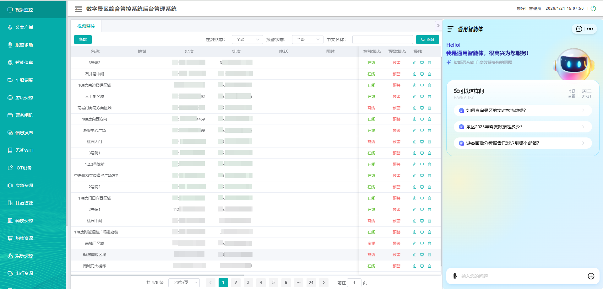
</div>

#### 4、移动端交互智能体
在移动设备上，用户可以通过语音或文字与智能体进行交互，实现信息查询、任务管理、智能提醒等功能，成为用户的便携式个人助理。

<p align="center">
  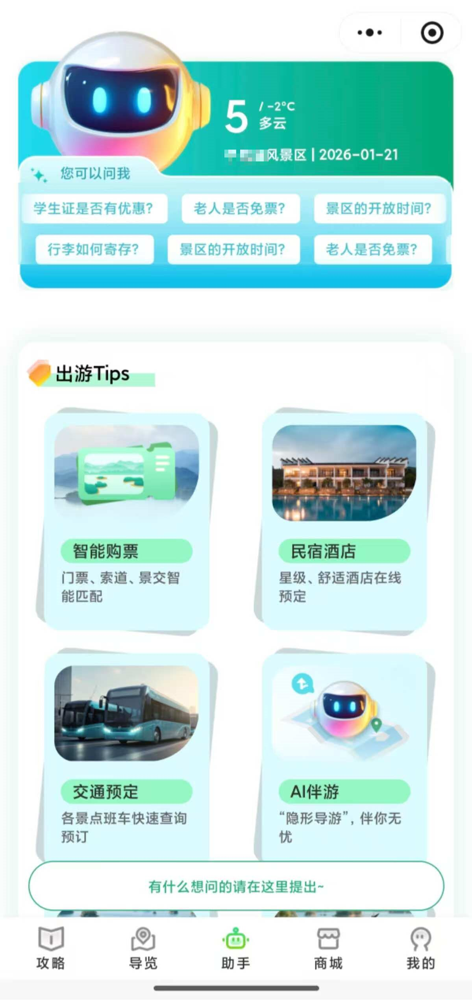
  &nbsp;&nbsp;&nbsp;&nbsp;
  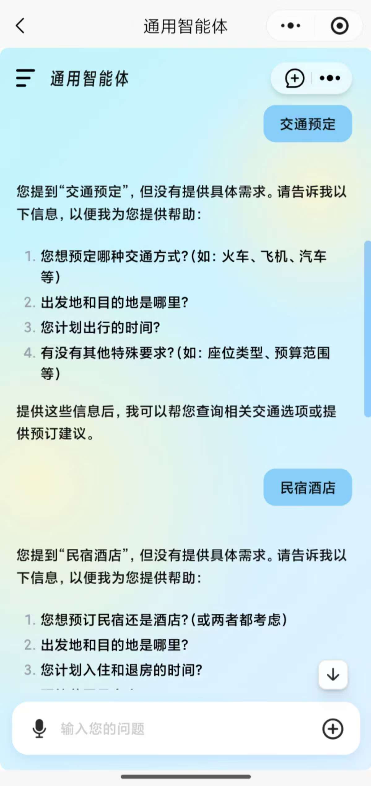
</p>

#### 5、移动端管理智能体
将 Agenta 智能体以悬浮窗或内嵌聊天窗口的形式集成到现有移动应用中。当用户在应用内遇到问题时，可随时唤醒智能体，实现即时问答和业务引导，提升用户体验。


<p align="center">
    
    &nbsp;&nbsp;&nbsp;&nbsp;
    
</div>

## 交互开发

外部系统可集成此智能体应用，以数字人或聊天对话的形式实现智能交互，支持自动页面跳转、数据查询及增删改查等操作。

### 核心功能

- **页面路由跳转**: 支持页面的智能跳转
- **数据查询**: 实时查询并反馈页面数据
- **数据操作**: 支持新增、修改、删除操作
- **数字人集成**: 支持数字人形式的语音交互操作
- **聊天页面集成**: 支持通过聊天页对外部系统进行智能交互

### 配置信息

外部系统接入本系统需要配置以下信息：

| 配置项 | 说明 | 示例 |
|--------|------|------|
| **WebSocket地址** | Socket.IO服务地址 | `https://dh.example.com:5001` |
| **数字人地址** | 数字人iframe地址（可选） | `https://dh.example.com/digitalhuman/628d9cfa1d6047549baead18dd81490` |
| **聊天框地址** | 前端聊天界面iframe地址（可选） | `https://dh.example.com/chat/628d9cfa1d6047549baead18dd81490` |

### 调用流程（Vue3 版本）

#### 1、 初始化连接流程

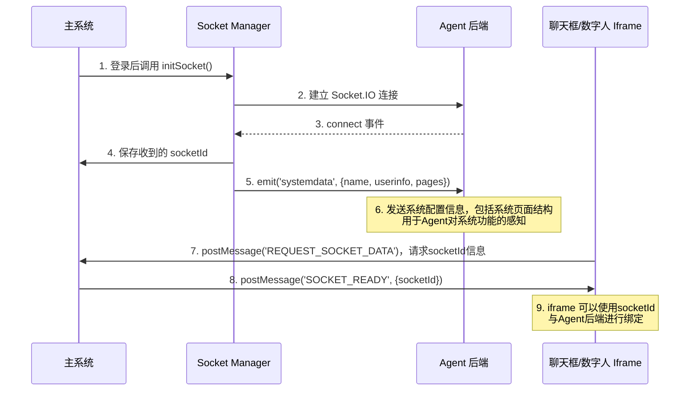
```mermaid
sequenceDiagram
    participant M as 主系统
    participant S as Socket Manager
    participant AI as Agent 后端
    participant I as 聊天框/数字人 Iframe

    M->>S: 1. 登录后调用 initSocket()
    S->>AI: 2. 建立 Socket.IO 连接
    AI-->>S: 3. connect 事件
    S->>M: 4. 保存收到的 socketId

    S->>AI: 5. emit('systemdata', {name, userinfo, pages})
    Note over AI: 6. 发送系统配置信息，包括系统页面结构<br/>用于Agent对系统功能的感知

    I->>M: 7. postMessage('REQUEST_SOCKET_DATA')，请求socketId信息
    M->>I: 8. postMessage('SOCKET_READY', {socketId})

    Note over I: 9. iframe 可以使用socketId <br/>与Agent后端进行绑定
```

#### 2、 用户发起请求流程

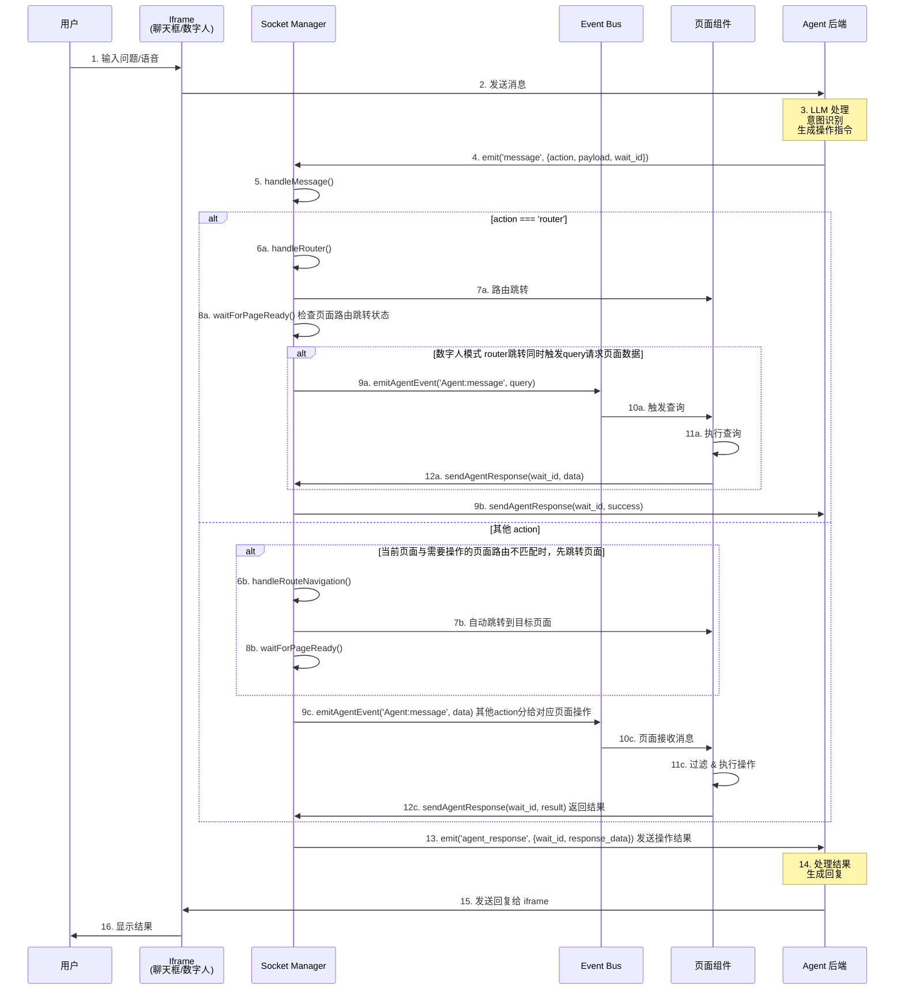
```mermaid
sequenceDiagram
    participant U as 用户
    participant I as Iframe<br/>(聊天框/数字人)
    participant S as Socket Manager
    participant E as Event Bus
    participant Page as 页面组件
    participant AI as Agent 后端

    U->>I: 1. 输入问题/语音
    I->>AI: 2. 发送消息
    Note over AI: 3. LLM 处理<br/>意图识别<br/>生成操作指令
    AI->>S: 4. emit('message', {action, payload, wait_id})
    S->>S: 5. handleMessage()

    alt action === 'router'
        S->>S: 6a. handleRouter()
        S->>Page: 7a. 路由跳转
        S->>S: 8a. waitForPageReady() 检查页面路由跳转状态

        alt 数字人模式 router跳转同时触发query请求页面数据
            S->>E: 9a. emitAgentEvent('Agent:message', query)
            E->>Page: 10a. 触发查询
            Page->>Page: 11a. 执行查询
            Page->>S: 12a. sendAgentResponse(wait_id, data)
        end
            S->>AI: 9b. sendAgentResponse(wait_id, success)
        
    else 其他 action
        alt 当前页面与需要操作的页面路由不匹配时，先跳转页面
            S->>S: 6b. handleRouteNavigation()
            S->>Page: 7b. 自动跳转到目标页面
            S->>S: 8b. waitForPageReady()
        end

        S->>E: 9c. emitAgentEvent('Agent:message', data) 其他action分给对应页面操作
        E->>Page: 10c. 页面接收消息
        Page->>Page: 11c. 过滤 & 执行操作
        Page->>S: 12c. sendAgentResponse(wait_id, result) 返回结果
    end

    S->>AI: 13. emit('agent_response', {wait_id, response_data}) 发送操作结果
    Note over AI: 14. 处理结果<br/>生成回复
    AI->>I: 15. 发送回复给 iframe
    I->>U: 16. 显示结果
```

### 调用说明

#### 1、socket初始化，建立连接并发送系统配置数据

```javascript
import { io } from 'socket.io-client';

// 页面配置示例（需要根据实际业务定义）
const pageConfigs = [
  {
    code: 'dashboard',
    name: '仪表盘',
    description: '系统概览',
    actions: ['router', 'query']
  },
  // ... 更多页面配置
];

// 用户信息（通常从状态管理或登录信息中获取）
let userInfo = {
  userId: 'user123',
  username: '张三',
  systemName: '系统名称',
  websocketUrl: 'ws://your-server-url'
};

// 创建 Socket 连接
const socket = io(userInfo.websocketUrl, {
  transports: ['websocket', 'polling'],
  reconnection: true,
  reconnectionAttempts: 5,
  reconnectionDelay: 3000,
  timeout: 10000
});

// 监听连接成功事件
socket.on('connect', () => {
  console.log('Socket 连接成功，ID:', socket.id);
  
  // 保存 socketId 信息，用于后续绑定聊天框/数字人iframe（实际项目中应保存到状态管理如 Pinia/Vuex）
  userInfo.socketId = socket.id;
  console.log('Socket ID 已保存:', userInfo.socketId);
  
  // 发送系统配置数据
  const systemData = {
    name: userInfo.systemName,
    userinfo: {
      destination_id: userInfo.userId,
      user_id: userInfo.userId,
      username: userInfo.username
    },
    type: 'page_module',
    description: userInfo.systemName,
    pages: pageConfigs
  };
  
  socket.emit('systemdata', systemData);
  console.log('系统配置数据已发送');
});

// 监听连接错误
socket.on('connect_error', (error) => {
  console.error('连接错误:', error.message);
});

// 监听断开连接
socket.on('disconnect', (reason) => {
  console.warn('连接已断开:', reason);
  
  // 如果是服务器主动断开，尝试重连
  if (reason === 'io server disconnect') {
    socket.connect();
  }
});

// 监听服务器消息
socket.on('message', (data) => {
  console.log('收到消息:', data);
  // 处理消息逻辑
});

```

#### 2、系统配置数据

```javascript
// 页面配置对象
const pageConfig = {
  code: 'cockpit',              // 页面唯一标识（必填）- Agent 用于识别页面
  name: '驾驶舱',                // 页面中文名称（必填）- 显示给用户看
  routePath: '/cockpit',        // 路由路径（必填）- Vue Router 路径
  action: ['router', 'query'],  // 支持的操作类型（必填）- 该页面支持哪些操作
  description: '系统总览页面',   // 页面描述（必填）- 告诉 Agent 这个页面是做什么的
  children: [],                 // 子页面配置（可选）- 树形结构的子页面
  examples: {},                 // 操作示例（可选）- 展示请求和响应格式
  metadataConfig: {}            // 元数据配置（可选）- 需要获取元数据的页面使用
};

// 完整示例
// 示例1: 简单页面配置（只支持路由跳转和查询）
{
  code: 'cockpit',
  name: '驾驶舱',
  routePath: '/cockpit',
  action: ['router', 'query'],
  description: '系统总览页面，展示系统的整体数据和状态'
}

// 示例2: 完整的 CRUD 页面配置（带操作示例）
{
  code: 'engineeringlist',
  name: '工程列表',
  routePath: '/projects/list',
  action: ['router', 'query', 'add', 'modify', 'delete'],
  description: '工程列表管理，支持增删改查',
  examples: {
    query: {
      description: '查询工程列表',
      request: {
        action: 'query',
        payload: {
          code: 'engineeringlist',
          type: 'page_module',
          query: { name: '工程1' }
        }
      },
      response: {
        message: '查询完成，找到 5 条工程记录',
        data: { total: 5, list: [/* ... */] }
      }
    }
  }
}

// 示例3: 需要元数据的页面配置
{
  code: 'devicelist',
  name: '设备列表',
  routePath: '/device/list',
  action: ['router', 'query', 'add', 'modify', 'delete', 'get_metadata'],
  description: '设备列表管理，支持增删改查',
  metadataConfig: {
    action: 'get_metadata',
    description: '获取表单字段映射关系，包括设备类型、监测类型、健康状态等下拉选项'
  }
}

// 示例4: 带子页面的树形结构
{
  code: 'warnmanage',
  name: '警情管理',
  routePath: '/warning',
  action: ['router'],
  description: '警情管理模块',
  children: [
    {
      code: 'warnoverview',
      name: '警情总览',
      routePath: '/warning/overview',
      action: ['router'],
      description: '警情信息总览'
    },
    {
      code: 'warnmessage',
      name: '警情消息',
      routePath: '/warning/messages',
      action: ['router', 'query'],
      description: '警情消息列表'
    }
  ]
}
```


##### 📋 参数详细说明

<table>
<tr>
<td width="30%">

**1. `code` - 页面标识**

</td>
<td>

- **类型**: `string`
- **作用**: 页面的唯一标识符，Agent 通过这个 code 来定位页面
- **示例**: `'cockpit'`, `'devicelist'`, `'engineeringlist'`

</td>
</tr>
<tr>
<td>

**2. `name` - 页面名称**

</td>
<td>

- **类型**: `string`
- **作用**: 页面的中文显示名称，用于向用户展示
- **示例**: `'驾驶舱'`, `'设备列表'`, `'工程列表'`

</td>
</tr>
<tr>
<td>

**3. `routePath` - 路由路径**

</td>
<td>

- **类型**: `string`
- **作用**: Vue Router 的路由路径，用于页面跳转
- **示例**: `'/cockpit'`, `'/device/list'`, `'/projects/list'`

</td>
</tr>
<tr>
<td>

**4. `action` - 支持的操作**

</td>
<td>

- **类型**: `string[]`
- **作用**: 定义该页面支持哪些操作类型
- **可选值**:
  - `'router'` - 路由跳转
  - `'query'` - 查询数据
  - `'add'` - 新增数据
  - `'modify'` - 修改数据
  - `'delete'` - 删除数据
  - `'get_metadata'` - 获取元数据（表单字段等映射数据）
- **示例**: `['router', 'query']`, `['router', 'query', 'add', 'modify', 'delete']`

</td>
</tr>
<tr>
<td>

**5. `description` - 页面描述**

</td>
<td>

- **类型**: `string`
- **作用**: 详细描述页面功能，帮助 Agent 理解页面用途
- **示例**: `'系统总览页面，展示边坡监测的整体数据和状态'`

</td>
</tr>
<tr>
<td>

**6. `children` - 子页面** *(可选)*

</td>
<td>

- **类型**: `PageConfig[]`
- **作用**: 树形结构的子页面配置，用于多级菜单
- **示例**: 警情管理下有警情总览、警情消息等子页面

</td>
</tr>
<tr>
<td>

**7. `examples` - 操作示例** *(可选)*

</td>
<td>

- **类型**: `object`
- **作用**: 展示每种操作的请求和响应格式，帮助 Agent 理解如何调用该页面的操作
- **结构**:
```javascript
{
  query: {
    description: '操作说明',
    request: { /* 请求格式 */ },
    response: { /* 响应格式 */ }
  },
  add: { /* ... */ },
  modify: { /* ... */ },
  delete: { /* ... */ }
}
```

</td>
</tr>
<tr>
<td>

**8. `metadataConfig` - 元数据配置** *(可选)*

</td>
<td>

- **类型**: `object`
- **作用**: 对于需要获取表单字段映射的页面（如下拉选项等数据），配置元数据获取说明
- **示例**:
```javascript
{
  action: 'get_metadata',
  description: '获取表单字段映射关系，包括设备类型、监测类型等下拉选项'
}
```

</td>
</tr>
</table>

#### 3、聊天框/数字人 iframe 与主系统通信
1、主系统向两个 iframe（聊天框和数字人）发送 socketId，绑定socketId。
2、主系统控制数字人 iframe 的录音监听与播放讲话的中断

```javascript
// 1. 初始化
const dhumanIframeRef = ref<HTMLIFrameElement>();
const socketId = ref('socket-123'); //使用socket连接时保存的socketId
const websocketUrl = ref('wss://example.com/ws');

// 2. 监听iframe消息
window.addEventListener('message', (event) => {
  if (event.data.type === 'IFRAME_READY') {
    // iframe准备好了，发送Socket数据
    dhumanIframeRef.value.contentWindow.postMessage({
      type: 'SOCKET_DATA',
      data: {
        socketId: socketId.value,
        websocketUrl: websocketUrl.value
      }
    }, '*');
  }

  if (event.data.type === 'LISTENING_STATE_CHANGED') {
    console.log('监听状态:', event.data.data.isListening);
  }
});

// 3. 用户启动数字人时，启动监听
function showDigitalHuman() {
  dhumanIframeRef.value.contentWindow.postMessage({
    type: 'CONTROL_LISTENING',
    action: 'start'
  }, '*');
}

// 4. 用户关闭数字人时，停止监听和讲话
function hideDigitalHuman() {
  dhumanIframeRef.value.contentWindow.postMessage({
    type: 'CONTROL_LISTENING',
    action: 'stop'
  }, '*');

  dhumanIframeRef.value.contentWindow.postMessage({
    type: 'CONTROL_SPEAKING',
    action: 'interrupt'
  }, '*');
}

```

##### 📋 消息类型速查表

##### 主应用 → iframe

| 消息类型 | 参数 | 说明 |
|---------|------|------|
| `CONTROL_LISTENING` | `action: 'start' \| 'stop'` | 控制录音监听 |
| `CONTROL_SPEAKING` | `action: 'interrupt'` | 中断讲话 |
| `SOCKET_DATA` | `{ socketId, websocketUrl }` | Socket连接信息 |

##### iframe → 主应用

| 消息类型 | 数据结构 | 说明 |
|---------|---------|------|
| `IFRAME_READY` | 无 | iframe准备就绪 |
| `CHAT_INIT_COMPLETE` | 无 | 聊天框初始化完成 |
| `DIGITAL_HUMAN_COMPLETION` | 无 | 数字人操作完成 |
| `REQUEST_SOCKET_DATA` | 无 | 请求Socket数据 |
| `LISTENING_STATE_CHANGED` | `{ isListening: boolean }` | 监听状态变化 |
| `SPEAKING_STATE_CHANGED` | `{ isSpeaking: boolean }` | 讲话状态变化 |
| `CONTROL_RESULT` | `{ action, success, message }` | 控制操作结果 |
| `PONG` | 无 | 心跳响应 |


#### 4、主系统接收 socket 控制消息处理

本节介绍如何在 Vue3 项目中接收和处理 Socket 控制消息。

##### 📐 架构说明

采用分层架构处理 Socket 消息:

```
Socket.IO 服务器
    ↓ (WebSocket 'message' 事件)
Socket Manager (socket.ts)
    ↓ (handleMessage 预处理)
Event Bus (mitt)
    ↓ (emitAgentEvent)
页面组件 (Vue3 Composition API)
    ↓ (onAgentEvent 监听)
业务处理函数
```

##### 🔧 实现步骤

**步骤 1: 创建 Socket 管理器**

```typescript
// socket/socket.ts
import { io } from 'socket.io-client';
import { emitAgentEvent } from './eventBus';

class SocketManager {
  private socket = null;
  private router = null;
  private pageReadyResolvers: Map<string, { resolve: () => void; timer: any }> = new Map();

  // 连接 Socket
  connect(url: string) {
    return new Promise((resolve) => {
      this.socket = io(url, {
        transports: ['websocket', 'polling'],
        reconnection: true,
        reconnectionAttempts: 5,
        reconnectionDelay: 3000,
        timeout: 10000
      });

      // 连接成功
      this.socket.on('connect', () => {
        console.log('Socket 连接成功，ID:', this.socket.id);
        resolve();
      });

      // 监听消息
      this.socket.on('message', (data) => {
        this.handleMessage(data);
      });
    });
  }

  // 处理消息
  private async handleMessage(data) {
    // router 操作特殊处理
    if (data.action === 'router') {
      this.handleRouter(data);
      return;
    }

    // 对于非 router 操作，检查是否需要先跳转页面
    const { payload } = data;
    const targetCode = payload?.code;

    if (targetCode && this.router) {
      const currentRoute = this.router.currentRoute.value;
      const currentRouteName = currentRoute.name;

      // 如果当前路由不匹配，先跳转
      if (currentRouteName !== targetCode) {
        console.log(`当前路由 ${currentRouteName} 与目标页面 ${targetCode} 不匹配，先执行跳转`);
        await this.handleRouteNavigation(data);
      }
    }

    // 通过事件总线分发消息
    emitAgentEvent('Agent:message', data);
  }

  // 路由跳转处理
  private async handleRouter(data) {
    const { payload, wait_id } = data;
    const { code } = payload;

    try {
      // 执行路由跳转
      await this.router.push({ name: code });
      await this.router.isReady();

      console.log(`路由跳转到 ${code} 成功`);

      // 等待页面就绪
      await this.waitForPageReady(code, 3000);

      // 发送响应
      if (wait_id) {
        this.sendAgentResponse(wait_id, {
          message: '已成功跳转到相应页面',
          data: { code }
        });
      }
    } catch (error) {
      console.error('路由跳转失败:', error);
      if (wait_id) {
        this.sendAgentResponse(wait_id, {
          message: `路由跳转失败: ${error.message}`,
          data: null
        });
      }
    }
  }

  // 执行路由导航（不发送响应）
  private async handleRouteNavigation(data) {
    const { payload } = data;
    const { code } = payload;

    try {
      await this.router.push({ name: code });
      await this.router.isReady();
      await this.waitForPageReady(code, 2000);
      console.log(`页面 ${code} 已就绪，可以执行后续操作`);
    } catch (error) {
      console.error('路由跳转失败:', error);
    }
  }

  // 发送响应
  sendAgentResponse(waitId: string, responseData: any) {
    if (!this.socket?.connected) {
      console.warn('Socket 未连接，无法发送响应');
      return;
    }

    this.socket.emit('agent_response', {
      wait_id: waitId,
      response_data: responseData
    });
  }

  // 页面就绪通知
  notifyPageReady(code: string) {
    const resolver = this.pageReadyResolvers.get(code);
    if (resolver) {
      clearTimeout(resolver.timer);
      this.pageReadyResolvers.delete(code);
      resolver.resolve();
      console.log(`页面 ${code} 已就绪`);
    }
  }

  // 等待页面就绪
  waitForPageReady(code: string, timeout = 5000): Promise<void> {
    return new Promise((resolve) => {
      const timer = setTimeout(() => {
        console.warn(`页面 ${code} 就绪等待超时，继续执行`);
        this.pageReadyResolvers.delete(code);
        resolve();
      }, timeout);

      this.pageReadyResolvers.set(code, { resolve, timer });
    });
  }
}

// 导出单例
let socketManagerInstance: SocketManager | null = null;

export async function initSocket(url: string, router: any) {
  if (!socketManagerInstance) {
    socketManagerInstance = new SocketManager();
  }
  socketManagerInstance.router = router;
  await socketManagerInstance.connect(url);
  return socketManagerInstance;
}

export function getSocketManager(): SocketManager {
  if (!socketManagerInstance) {
    throw new Error('Socket 未初始化，请先调用 initSocket()');
  }
  return socketManagerInstance;
}
```

**步骤 2: 创建事件总线**

```typescript
// eventBus.ts
import mitt from 'mitt';

interface AgentMessage {
  action: string;
  payload: any;
  wait_id?: string;
}

type AgentEvents = {
  'Agent:message': AgentMessage;
};

export const agentEventBus = mitt<AgentEvents>();

export function emitAgentEvent<K extends keyof AgentEvents>(
  event: K,
  data: AgentEvents[K]
): void {
  agentEventBus.emit(event, data);
}

export function onAgentEvent<K extends keyof AgentEvents>(
  event: K,
  handler: (data: AgentEvents[K]) => void
): () => void {
  agentEventBus.on(event, handler);
  return () => agentEventBus.off(event, handler);
}
```

**步骤 3: 页面组件中监听消息**

```vue
<script setup lang="ts">
import { onMounted, onUnmounted, ref } from 'vue';
import { onAgentEvent } from '@/socket/eventBus';
import { getSocketManager } from '@/socket/socket';
import type { AgentMessage } from '@/socket/types';

// 表格 API 引用（根据实际项目调整）
const gridApi = ref<any>(null);
const formDrawerApi = ref<any>(null);

// 监听取消函数
let unsubscribeAgent: (() => void) | null = null;

onMounted(() => {
  // 监听 Agent 消息
  unsubscribeAgent = onAgentEvent('Agent:message', (message: AgentMessage) => {
    // 1. 过滤消息 - 只处理当前页面（根据实际页面 code 修改）
    if (message.payload?.code !== 'devicelist') {
      return;
    }

    console.log('[Agent] 收到消息:', message);

    // 2. 根据 action 分发到对应处理函数
    switch (message.action) {
      case 'query':
        handleAgentQuery(message);
        break;
      case 'add':
        handleAgentAdd(message);
        break;
      case 'modify':
        handleAgentModify(message);
        break;
      case 'delete':
        handleAgentDelete(message);
        break;
      case 'get_metadata':
        handleAgentGetMetadata(message);
        break;
      default:
        console.warn('[Agent] 未知的操作类型:', message.action);
    }
  });

  // 通知 Socket 管理器页面已就绪
  try {
    getSocketManager().notifyPageReady('devicelist');
  } catch (error) {
    console.warn('[Agent] Socket 未初始化，跳过页面就绪通知');
  }
});

onUnmounted(() => {
  // 清理监听器，防止内存泄漏
  if (unsubscribeAgent) {
    unsubscribeAgent();
  }
});

// ==================== 业务处理函数 ====================

/**
 * 查询处理
 */
const handleAgentQuery = async (message: AgentMessage) => {
  const { payload, wait_id } = message;

  try {
    console.log('[Agent Query] 收到查询请求:', message);

    // 构建查询条件
    const formData: any = {};

    if (payload.query) {
      // 如果是查询所有数据
      if (payload.query.dataType === 'all') {
        console.log('[Agent Query] 查询所有数据');
      } else {
        // 根据具体字段构建查询条件
        if (payload.query.name) {
          formData.name = payload.query.name;
        }
        if (payload.query.type_id !== undefined) {
          formData.type_id = payload.query.type_id;
        }
        // ... 其他查询字段
      }
    }

    console.log('[Agent Query] 查询条件:', formData);

    // 执行查询
    await gridApi.value.query(formData);

    // 获取查询结果
    const tableData = gridApi.value.grid?.getTableData?.()?.fullData || [];

    console.log('[Agent Query] 查询结果:', tableData.length, '条记录');

    // 发送响应
    if (wait_id) {
      getSocketManager().sendAgentResponse(wait_id, {
        message: `查询完成，找到 ${tableData.length} 条记录`,
        data: {
          total: tableData.length,
          list: tableData.slice(0, 20) // 只返回前20条，优化性能
        },
        is_summarize: true
      });
    }
  } catch (error) {
    console.error('[Agent Query] 错误:', error);
    if (wait_id) {
      getSocketManager().sendAgentResponse(wait_id, {
        message: `查询失败: ${error instanceof Error ? error.message : '未知错误'}`,
        data: null
      });
    }
  }
};

/**
 * 新增处理
 */
const handleAgentAdd = async (message: AgentMessage) => {
  const { payload, wait_id } = message;

  try {
    console.log('[Agent Add] 收到新增请求:', message);

    // 处理表单数据
    const formData = payload.form ? { ...payload.form } : {};

    // 打开新增表单并填充数据
    formDrawerApi.value.setData(formData).open();

    // 发送响应
    if (wait_id) {
      setTimeout(() => {
        getSocketManager().sendAgentResponse(wait_id, {
          message: '已打开新增表单，请确认后提交',
          data: payload.form
        });
      }, 500);
    }
  } catch (error) {
    console.error('[Agent Add] 错误:', error);
    if (wait_id) {
      getSocketManager().sendAgentResponse(wait_id, {
        message: `新增失败: ${error instanceof Error ? error.message : '未知错误'}`,
        data: null
      });
    }
  }
};

/**
 * 修改处理
 */
const handleAgentModify = async (message: AgentMessage) => {
  const { payload, wait_id } = message;

  try {
    console.log('[Agent Modify] 收到修改请求:', message);

    // 1. 先查询原记录
    const queryFormData: any = { name: payload.oldname };
    console.log('[Agent Modify] 查询条件:', queryFormData);

    await gridApi.value.query(queryFormData);

    const tableData = gridApi.value.grid?.getTableData?.()?.fullData || [];
    console.log('[Agent Modify] 查询结果:', tableData.length, '条记录');

    if (tableData.length === 0) {
      throw new Error(`未找到记录: ${payload.oldname}`);
    }

    const oldData = tableData[0];
    console.log('[Agent Modify] 找到记录:', oldData);

    // 2. 合并旧数据和新数据
    const formData = payload.form ? { ...payload.form } : {};
    const mergedData = { ...oldData, ...formData };

    console.log('[Agent Modify] 合并后的数据:', mergedData);

    // 3. 打开编辑表单
    formDrawerApi.value.setData(mergedData).open();

    // 4. 发送响应
    if (wait_id) {
      getSocketManager().sendAgentResponse(wait_id, {
        message: `已找到记录"${oldData.name}"，准备修改`,
        data: {
          found: true,
          oldData: oldData,
          newData: mergedData,
          changes: payload.form
        },
        is_summarize: true
      });
    }
  } catch (error) {
    console.error('[Agent Modify] 错误:', error);
    if (wait_id) {
      getSocketManager().sendAgentResponse(wait_id, {
        message: `修改失败: ${error instanceof Error ? error.message : '未知错误'}`,
        data: null
      });
    }
  }
};

/**
 * 删除处理
 */
const handleAgentDelete = async (message: AgentMessage) => {
  const { payload, wait_id } = message;

  try {
    console.log('[Agent Delete] 收到删除请求:', message);

    // 1. 查询记录
    const formData: any = { name: payload.name };
    await gridApi.value.query(formData);

    const tableData = gridApi.value.grid?.getTableData?.()?.fullData || [];
    if (tableData.length === 0) {
      throw new Error(`未找到记录: ${payload.name}`);
    }

    // 2. 触发删除确认对话框
    const targetData = tableData[0];
    handleDelete(targetData); // 调用原有的删除方法

    // 3. 发送响应
    if (wait_id) {
      setTimeout(() => {
        getSocketManager().sendAgentResponse(wait_id, {
          message: '已触发删除确认对话框',
          data: { name: targetData.name }
        });
      }, 500);
    }
  } catch (error) {
    console.error('[Agent Delete] 错误:', error);
    if (wait_id) {
      getSocketManager().sendAgentResponse(wait_id, {
        message: `删除失败: ${error instanceof Error ? error.message : '未知错误'}`,
        data: null
      });
    }
  }
};

/**
 * 获取元数据处理（可选）
 */
const handleAgentGetMetadata = (message: AgentMessage) => {
  const { wait_id } = message;

  try {
    console.log('[Agent Metadata] 收到获取元数据请求:', message);

    // 返回表单字段映射关系
    const metadata = {
      // 下拉选项数据
      deviceTypes: deviceTypeOptions.value,
      healthStates: getHealthStateOptions(),
      // ... 其他元数据
    };

    const fieldDescriptions = {
      name: '名称（必填，文本）',
      type_id: '类型ID（必填，数字）',
      // ... 其他字段说明
    };

    if (wait_id) {
      getSocketManager().sendAgentResponse(wait_id, {
        message: '已获取表单映射关系',
        data: {
          metadata,
          fieldDescriptions
        }
      });
    }
  } catch (error) {
    console.error('[Agent Metadata] 错误:', error);
    if (wait_id) {
      getSocketManager().sendAgentResponse(wait_id, {
        message: `获取元数据失败: ${error instanceof Error ? error.message : '未知错误'}`,
        data: null
      });
    }
  }
};

// 原有的删除方法（示例）
const handleDelete = (row: any) => {
  // 弹出确认对话框并执行删除
  // 实际实现根据项目调整
};
</script>
```

##### 📊 消息数据结构

```typescript
interface AgentMessage {
  action: 'query' | 'add' | 'modify' | 'delete' | 'router' | 'get_metadata';
  payload: {
    code: string;           // 页面标识
    type?: string;          // 模块类型
    query?: any;            // 查询条件
    form?: any;             // 表单数据
    oldname?: string;       // 修改时的旧名称
    name?: string;          // 删除时的名称
  };
  wait_id?: string;         // 响应ID
}

// 响应数据格式
interface AgentResponse {
  message: string;          // 操作结果描述
  data: any;                // 返回的数据
  is_summarize?: boolean;   // 是否需要 AI 总结
}
```

##### ✅ 关键要点

1. **消息过滤**: 必须检查 `message.payload?.code` 是否匹配当前页面，避免处理其他页面的消息
2. **清理监听**: 在 `onUnmounted` 中调用 `unsubscribe()` 防止内存泄漏
3. **页面就绪**: 调用 `notifyPageReady()` 确保页面准备好接收消息
4. **错误处理**: 所有处理函数都要 try-catch 并发送错误响应
5. **异步等待**: 查询操作需要等待数据加载完成再发送响应


## 🤝交流与社区

我们热情欢迎所有开发者和用户加入我们的社区！在这里，你可以自由提问、分享经验、贡献代码，共同推动项目的发展。

<div align="center">

<p align="center">加入微信交流群</p>
</div>

**更多链接:**

- **报告问题与建议 (Issues):** 前往 [GitHub Issues](https://github.com/winyeahs/agenta/issues) 提交您发现的 Bug 或功能建议。
- **参与讨论 (Discussions):** 加入我们的 [GitHub Discussions](https://github.com/winyeahs/agenta/discussions) 进行更深入的技术探讨和想法交流。
- **联系我们 (Contact):** 如有商务合作或其他事宜，请发送邮件至 `93634776@qq.com`。

